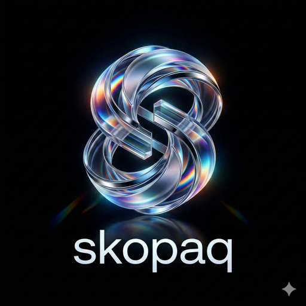

<div align="center">
  

  # Argus Backend - E2E Testing Agent

  **AI-Powered Autonomous Testing Engine**

  [](LICENSE)
  [](https://www.python.org/)
  [](https://github.com/langchain-ai/langgraph)
  [](https://anthropic.com)

  [](https://github.com/samuelvinay91/argus-backend/actions/workflows/test.yml)
  [](https://codecov.io/gh/samuelvinay91/argus-backend)
  [](https://codecov.io/gh/samuelvinay91/argus-backend)
  [](https://codecov.io/gh/samuelvinay91/argus-backend)
</div>

---

## 📦 Repository Structure

**This is the backend/core testing engine repository.**

| Repository | Purpose | Link |
|------------|---------|------|
| **argus-backend** (this repo) | Python testing engine, AI agents, orchestration | [github.com/samuelvinay91/argus-backend](https://github.com/samuelvinay91/argus-backend) |
| **argus** (frontend) | Next.js dashboard, UI components, visualization | [github.com/samuelvinay91/argus](https://github.com/samuelvinay91/argus) |

---

An AI-powered testing system that **autonomously tests your application** - no test writing required.

```bash
# That's it. The AI does everything.
e2e-agent --codebase ./my-app --app-url http://localhost:3000
```

**What it does**:
1. 🔍 **Analyzes your code** - understands your app structure
2. 📝 **Generates tests** - creates comprehensive test plans
3. ▶️ **Runs tests** - executes UI, API, and database tests
4. 🔧 **Self-heals** - fixes broken selectors automatically
5. 📊 **Reports** - gives you actionable results

> 📚 **See [docs/WORKFLOWS.md](./docs/WORKFLOWS.md) for detailed user workflows**

## ✨ Features

### Core Testing Capabilities
- **🔍 Codebase Analysis**: Automatically understands your application structure
- **📝 Test Generation**: Creates comprehensive E2E test plans from code analysis
- **🖥️ Visual UI Testing**: Uses Claude's Computer Use API to interact with browsers
- **🔌 API Testing**: Validates endpoints with schema verification
- **🗄️ Database Testing**: Checks data integrity and migrations
- **🔧 Self-Healing**: Automatically fixes broken selectors and timing issues
- **💰 Cost Tracking**: Monitors and limits API usage costs
- **🔀 Multi-Framework Support**: Playwright, Selenium, Computer Use, or Chrome Extension
- **🧩 Chrome Extension**: Real browser automation like Claude in Chrome / Antigravity

### Competitive Features (Industry-Leading)
- **👁️ Visual AI Regression** (like Applitools): Claude Vision-powered screenshot comparison for visual testing
- **💬 Plain English Tests** (like testRigor): Write tests in natural language - "Login as admin and create a new user"
- **🕷️ Auto-Discovery** (like Octomind): Automatically crawl your app and generate test scenarios
- **📊 Multi-Format Reports**: JSON, HTML, Markdown, and JUnit XML for CI/CD
- **🐙 GitHub Integration**: Automatic PR comments, check runs, and commit status updates
- **💬 Slack Notifications**: Real-time test results and failure alerts

## 🔌 MCP Server - AI IDE Integration

**Connect Argus to your AI coding assistant!** The Argus MCP Server allows Claude Code, Cursor, Windsurf, and other MCP-compatible IDEs to run E2E tests directly.

### Available Tools

| Tool | Description |
|------|-------------|
| `argus_health` | Check Argus API status |
| `argus_discover` | Discover interactive elements on a page |
| `argus_act` | Execute browser actions (click, type, navigate) |
| `argus_test` | Run multi-step E2E tests with screenshots |
| `argus_extract` | Extract structured data from pages |
| `argus_agent` | Autonomous task completion |
| `argus_generate_test` | Generate test steps from natural language |

### Setup for Claude Code / Claude Desktop

Add to your MCP settings:

```json
{
  "mcpServers": {
    "argus": {
      "command": "npx",
      "args": ["-y", "mcp-remote", "https://argus-mcp.samuelvinay-kumar.workers.dev/sse"]
    }
  }
}
```

### Setup for Cursor

Add to Cursor's MCP settings:

```json
{
  "mcpServers": {
    "argus": {
      "url": "https://argus-mcp.samuelvinay-kumar.workers.dev/sse"
    }
  }
}
```

### Example Usage

```
# In your AI IDE, you can now say:
"Use argus_test to test login on https://example.com with steps:
1. Type 'user@example.com' in the email field
2. Type 'password123' in the password field
3. Click the Login button
4. Verify the dashboard loads"
```

> 📖 **See [skopaq-mcp-server/README.md](./skopaq-mcp-server/README.md) for full MCP documentation**

---

## 🚀 Quick Start

### Prerequisites

- Python 3.11+
- Anthropic API key
- Docker (for Computer Use sandbox)

### Installation

```bash
# Clone the repository
git clone https://github.com/samuelvinay91/argus-backend.git
cd argus-backend

# Create virtual environment
python -m venv venv
source venv/bin/activate  # On Windows: venv\Scripts\activate

# Install dependencies
pip install -e .

# Set up environment
cp .env.example .env
# Edit .env and add your ANTHROPIC_API_KEY
```

### Basic Usage

```bash
# Run tests against your application
e2e-agent --codebase /path/to/your/app --app-url http://localhost:3000

# With PR integration
e2e-agent --codebase . --app-url http://preview.example.com --pr 123

# Target specific changed files
e2e-agent --codebase . --app-url http://localhost:3000 --changed-files src/login.tsx src/api/auth.ts
```

### Python API

```python
from e2e_testing_agent import TestingOrchestrator

orchestrator = TestingOrchestrator(
    codebase_path="/path/to/app",
    app_url="http://localhost:3000"
)

results = await orchestrator.run()
print(f"Passed: {results['passed_count']}, Failed: {results['failed_count']}")
```

## 🔀 Browser Automation Options

By default, the agent uses **Playwright** (fast, reliable, works in CI). But you have options:

| When to use | Framework | Command |
|-------------|-----------|---------|
| **Most cases (default)** | Playwright | Just run `e2e-agent` |
| Need your existing cookies/auth | Chrome Extension | See [extension/README.md](./extension/README.md) |
| Sites detect bots | Computer Use | `--browser computer_use` |
| Flaky selectors | Hybrid | `--browser hybrid` |

**For advanced usage**, see [docs/WORKFLOWS.md](./docs/WORKFLOWS.md#browser-automation-options)

## 👁️ Visual AI Testing

Detect visual regressions using Claude's Vision capabilities:

```python
from e2e_testing_agent.agents import VisualAI, VisualRegressionManager

# Compare two screenshots
visual_ai = VisualAI()
result = await visual_ai.compare(baseline_screenshot, current_screenshot)
print(f"Match: {result.matches}, Differences: {result.differences}")

# Manage baselines automatically
manager = VisualRegressionManager(baseline_dir="./baselines")
result = await manager.check_visual_regression("login-test", current_screenshot)
if not result.matches:
    print(f"Visual regression detected: {result.differences}")
```

## 💬 Plain English Test Creation

Write tests in natural language - no code required:

```python
from e2e_testing_agent.agents import NLPTestCreator

creator = NLPTestCreator()

# Create tests from plain English
test = await creator.create("Login as admin@example.com and verify dashboard shows 5 widgets")
print(test.to_spec())  # Returns executable test specification

# From user stories
tests = await creator.create_from_story("""
As a user, I want to reset my password
So that I can regain access to my account
""")
```

## 🕷️ Auto-Discovery Mode

Automatically crawl your app and generate test scenarios:

```python
from e2e_testing_agent.agents import AutoDiscovery, QuickDiscover

# Full discovery
discovery = AutoDiscovery(app_url="http://localhost:3000")
result = await discovery.discover(focus_areas=["authentication", "checkout"])
print(f"Discovered {len(result.test_suggestions)} test scenarios")

# Quick discovery for common flows
quick = QuickDiscover(app_url="http://localhost:3000")
login_tests = await quick.discover_login_flow()
critical_tests = await quick.discover_critical_flows()
```

## 📖 Architecture

```
┌─────────────────────────────────────────────────────────────────────┐
│                         ORCHESTRATOR (LangGraph)                     │
│                    Manages state, routes to agents                   │
└─────────────────────────────────────────────────────────────────────┘
                                    │
        ┌───────────────────────────┼───────────────────────────┐
        ▼                           ▼                           ▼
┌───────────────┐           ┌───────────────┐           ┌───────────────┐
│ CODE ANALYZER │           │ TEST EXECUTOR │           │  SELF-HEALER  │
│    AGENT      │           │    AGENTS     │           │     AGENT     │
├───────────────┤           ├───────────────┤           ├───────────────┤
│ • Parse code  │           │ • UI Tester   │           │ • Analyze fail│
│ • Find tests  │           │ • API Tester  │           │ • Fix selector│
│ • Gen specs   │           │ • DB Tester   │           │ • Update tests│
└───────────────┘           └───────────────┘           └───────────────┘
```

## 💰 Pricing Estimates

| Model | Input ($/M tokens) | Output ($/M tokens) | Use Case |
|-------|-------------------|---------------------|----------|
| Claude Sonnet 4.5 | $3.00 | $15.00 | Primary testing |
| Claude Haiku 4.5 | $0.25 | $1.25 | Quick verifications |
| Claude Opus 4.5 | $5.00 | $25.00 | Complex debugging |

**Typical costs:**
- Single UI test (10 steps): ~$0.13-0.15
- 100 tests/day: ~$13-15/day
- Full test suite: Depends on complexity

## 🔧 Configuration

```bash
# .env file
ANTHROPIC_API_KEY=sk-ant-...

# Model selection
DEFAULT_MODEL=claude-sonnet-4-5
VERIFICATION_MODEL=claude-haiku-4-5
DEBUGGING_MODEL=claude-opus-4-5

# Cost controls
COST_LIMIT_PER_RUN=10.00
COST_LIMIT_PER_TEST=1.00

# Computer Use settings
SCREENSHOT_WIDTH=1920
SCREENSHOT_HEIGHT=1080
MAX_ITERATIONS=50

# Self-healing
SELF_HEAL_ENABLED=true
SELF_HEAL_CONFIDENCE_THRESHOLD=0.8
```

## 🔌 Integrations

### GitHub Actions

```yaml
name: AI E2E Tests
on:
  pull_request:
    branches: [main]

jobs:
  test:
    runs-on: ubuntu-latest
    steps:
      - uses: actions/checkout@v4

      - name: Start app
        run: docker-compose up -d

      - name: Run AI E2E Tests
        env:
          ANTHROPIC_API_KEY: ${{ secrets.ANTHROPIC_API_KEY }}
          GITHUB_TOKEN: ${{ secrets.GITHUB_TOKEN }}
        run: |
          pip install e2e-testing-agent
          e2e-agent --codebase . --app-url http://localhost:3000 --pr ${{ github.event.number }}
```

### GitHub PR Integration

Test results are automatically posted as PR comments with:
- Pass/fail summary table
- Failure details with root cause analysis
- Links to full reports

```python
from e2e_testing_agent.integrations import GitHubIntegration

github = GitHubIntegration(token="ghp_...")

# Post PR comment
await github.post_pr_comment(
    owner="myorg",
    repo="myapp",
    pr_number=123,
    summary=test_summary
)

# Create check run
await github.create_check_run(owner="myorg", repo="myapp", sha="abc123", summary=test_summary)
```

### Slack Notifications

Get real-time notifications in Slack:

```python
from e2e_testing_agent.integrations import SlackIntegration

slack = SlackIntegration(webhook_url="https://hooks.slack.com/...")

# Send test results
await slack.send_test_results(summary, channel="#qa-alerts")

# Send failure alert (for critical tests)
await slack.send_failure_alert(
    test_id="checkout-flow",
    error="Payment form not loading",
    root_cause="API timeout on /api/stripe/config"
)
```

Set environment variables for automatic notifications:
```bash
SLACK_WEBHOOK_URL=https://hooks.slack.com/services/...
# or
SLACK_BOT_TOKEN=xoxb-...
```

### n8n Webhook

```python
from fastapi import FastAPI
from e2e_testing_agent import TestingOrchestrator

app = FastAPI()

@app.post("/webhook/test")
async def run_tests(payload: dict):
    orchestrator = TestingOrchestrator(
        codebase_path=payload["repo_path"],
        app_url=payload["preview_url"],
        pr_number=payload["pr_number"]
    )
    return await orchestrator.run()
```

### Report Export

Reports are automatically saved in multiple formats:

```bash
./test-results/run_20250127_143022/
├── results.json      # Machine-readable results
├── report.html       # Interactive HTML report
├── report.md         # Markdown for GitHub/docs
├── junit.xml         # JUnit XML for CI/CD integration
└── screenshots/      # Failure screenshots
    ├── login-test_step0.png
    └── checkout_step3.png
```

## 📁 Project Structure

```
e2e-testing-agent/
├── CLAUDE.md                    # Claude Code instructions
├── README.md                    # This file
├── pyproject.toml               # Dependencies
├── src/
│   ├── main.py                  # Entry point
│   ├── config.py                # Configuration
│   ├── orchestrator/
│   │   ├── graph.py             # LangGraph state machine
│   │   ├── state.py             # State definitions
│   │   └── nodes.py             # Node implementations
│   ├── agents/
│   │   ├── base.py              # BaseAgent with Claude API
│   │   ├── code_analyzer.py     # Codebase analysis
│   │   ├── test_planner.py      # Test plan generation
│   │   ├── ui_tester.py         # UI test execution
│   │   ├── api_tester.py        # API test execution
│   │   ├── db_tester.py         # Database validation
│   │   ├── self_healer.py       # Auto-fix broken tests
│   │   ├── reporter.py          # Report generation
│   │   ├── visual_ai.py         # Visual AI regression (like Applitools)
│   │   ├── nlp_test_creator.py  # Plain English tests (like testRigor)
│   │   └── auto_discovery.py    # Auto-discovery (like Octomind)
│   ├── integrations/
│   │   ├── github_integration.py  # GitHub PR comments & checks
│   │   ├── slack_integration.py   # Slack notifications
│   │   └── reporter.py            # Multi-format report export
│   ├── tools/
│   │   ├── browser_abstraction.py  # Multi-framework support
│   │   ├── extension_bridge.py     # Chrome extension bridge
│   │   ├── playwright_tools.py     # Playwright utilities
│   │   └── api_tools.py            # API testing tools
│   ├── computer_use/
│   │   └── client.py            # Computer Use API wrapper
│   ├── mcp/
│   │   ├── langgraph_mcp.py     # MCP integration
│   │   └── playwright_mcp.py    # Playwright MCP server
│   └── utils/
│       ├── logging.py           # Structured logging
│       ├── tokens.py            # Token counting & costs
│       └── prompts.py           # Prompt templates
├── extension/                   # Chrome Extension
│   ├── manifest.json            # Extension manifest
│   ├── background.js            # WebSocket & tab management
│   ├── content.js               # DOM access & actions
│   ├── popup.html               # Extension UI
│   ├── popup.js                 # UI logic
│   └── README.md                # Installation guide
├── skills/
│   └── e2e-testing/
│       └── SKILL.md             # Claude Code skill
└── docs/
    └── ...
```

## 🛡️ Security

**Enterprise-grade security built in:**

| Feature | Description |
|---------|-------------|
| **Secret Detection** | API keys, passwords, tokens automatically redacted before AI analysis |
| **Data Classification** | 4-level classification (public/internal/confidential/restricted) |
| **User Consent** | Explicit approval required before sending data to external services |
| **Audit Logging** | SOC2/ISO27001 compliant logging of all AI interactions |
| **PII Detection** | Automatic detection of emails, phone numbers, SSN, credit cards |

```python
# Your secrets are NEVER sent to AI
# Original: API_KEY = "sk-ant-1234567890"
# Sent to Claude: API_KEY = "[REDACTED]:api_key"
```

**Additional safeguards:**
- Restricted files (`.env`, credentials, keys) are never read
- All file access is logged for compliance
- Cost limits prevent runaway API usage
- Browser interactions happen in Docker sandboxes

> 📖 **See [docs/SECURITY.md](./docs/SECURITY.md) for complete enterprise security documentation**

## 📚 Documentation

- [docs/WORKFLOWS.md](./docs/WORKFLOWS.md) - **Start here!** User workflows and examples
- [docs/ARCHITECTURE_DIAGRAMS.md](./docs/ARCHITECTURE_DIAGRAMS.md) - **Complete system architecture** with C4, ERD, sequence diagrams
- [docs/SECURITY.md](./docs/SECURITY.md) - Enterprise security architecture
- [docs/COMPETITIVE_ANALYSIS.md](./docs/COMPETITIVE_ANALYSIS.md) - Feature comparison with competitors
- [docs/QUICKSTART.md](./docs/QUICKSTART.md) - 1-minute setup guide
- [extension/README.md](./extension/README.md) - Chrome extension setup
- [CLAUDE.md](./CLAUDE.md) - Implementation guide (for developers)
- [skills/e2e-testing/SKILL.md](./skills/e2e-testing/SKILL.md) - Claude Code skill reference

## 🤝 Contributing

Contributions are welcome! Please read the contributing guidelines first.

## 📄 License

MIT License - see [LICENSE](./LICENSE) for details.

## 🙏 Acknowledgments

Built with:
- [Anthropic Claude](https://anthropic.com) - AI models and Computer Use API
- [LangGraph](https://github.com/langchain-ai/langgraph) - Agent orchestration
- [Playwright](https://playwright.dev) - Browser automation
