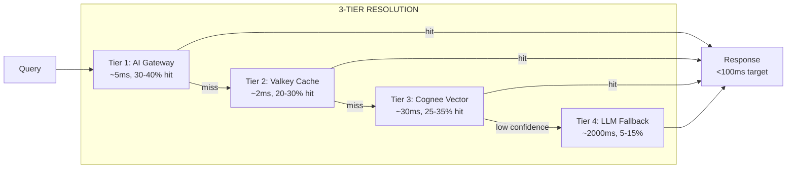
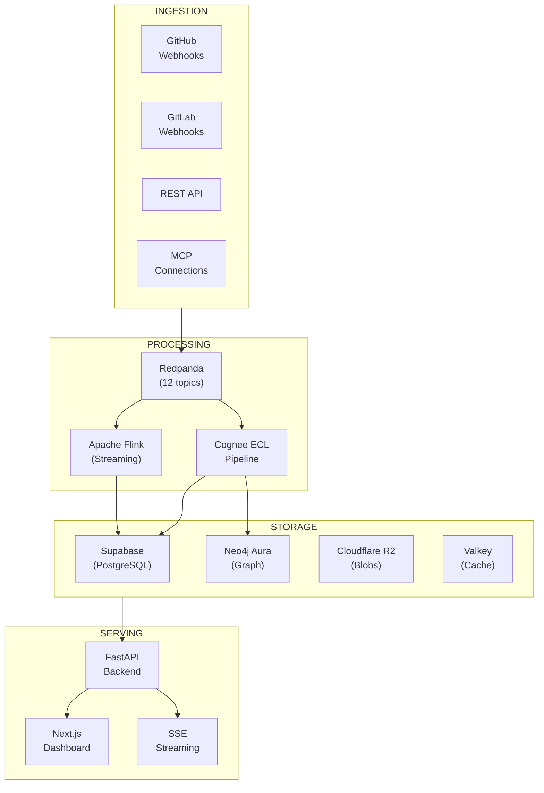
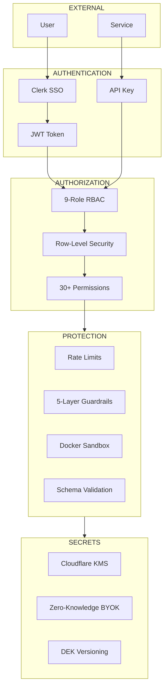
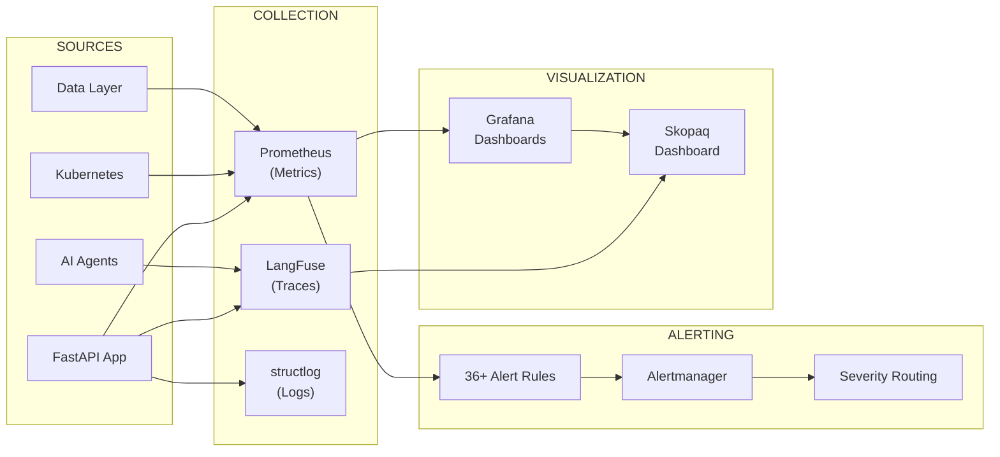
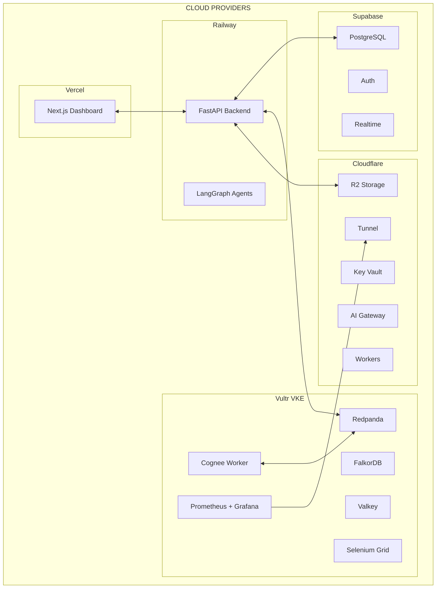

# Skopaq Architecture - Mermaid Diagrams

## High-Level Platform Architecture

```mermaid
flowchart TB
    subgraph UX["USER EXPERIENCE PLANE"]
        Dashboard["Dashboard<br/>(Next.js)"]
        AgentBuilder["Agent Builder<br/>(29 Agents)"]
        DevEx["DevEx<br/>(MCP, SDK, API)"]
    end

    subgraph Trust["TRUST BOUNDARY"]
        Auth["JWT + API Key"]
        RateLimit["Rate Limits<br/>(30-2000/min)"]
        Guardrails["5-Layer<br/>Guardrails"]
        RBAC["RBAC<br/>(9 roles)"]
    end

    subgraph Control["CONTROL PLANE"]
        Orchestrator["LangGraph<br/>Orchestrator"]
        AgentRegistry["Agent Registry<br/>(41 capabilities)"]
        A2A["A2A Protocol<br/>(Kafka mesh)"]
        Router["Model Router<br/>(300+ models)"]
        Evals["Agent-as-Judge<br/>+ MetaJudge"]
    end

    subgraph Runtime["RUNTIME PLANE"]
        Executor["Parallel<br/>Executor"]
        Sandbox["Docker<br/>Sandbox"]
        BrowserPool["Browser Pool<br/>(Selenium)"]
        Gateway["Event<br/>Gateway"]
    end

    subgraph Memory["CONTEXT & MEMORY PLANE"]
        Cache["Valkey<br/>Cache"]
        Checkpoints["PostgreSQL<br/>Checkpoints"]
        Cognee["Cognee<br/>Vector Search"]
        EpisodicMem["Episodic +<br/>Procedural Memory"]
    end

    subgraph Data["DATA PLANE"]
        Kafka["Redpanda/Kafka<br/>(12 topics)"]
        Supabase["Supabase<br/>PostgreSQL"]
        R2["Cloudflare R2<br/>(Screenshots)"]
        Flink["Apache Flink<br/>(Streaming)"]
        Neo4j["Neo4j Aura<br/>(Knowledge Graph)"]
    end

    subgraph Observe["OBSERVABILITY PLANE"]
        LangFuse["LangFuse<br/>Traces"]
        Prometheus["Prometheus<br/>Metrics"]
        Alerts["36+ Alerts<br/>(Alertmanager)"]
        Audit["Audit Logs<br/>(365 days)"]
    end

    subgraph Security["SECURITY PLANE"]
        SSO["Clerk SSO<br/>/OIDC"]
        KMS["Cloudflare<br/>Key Vault"]
        RLS["Row-Level<br/>Security"]
        Encryption["AES-256<br/>Encryption"]
    end

    UX --> Trust
    Trust --> Control
    Control --> Runtime
    Runtime --> Memory
    Memory --> Data

    Control -.-> Observe
    Runtime -.-> Observe
    Data -.-> Observe

    Trust -.-> Security
    Data -.-> Security
```

## Agent Mesh Architecture (A2A)

```mermaid
flowchart LR
    subgraph Supervisor["SUPERVISOR"]
        LangGraph["LangGraph<br/>State Machine"]
    end

    subgraph Agents["29 AI AGENTS"]
        CodeAnalyzer["Code<br/>Analyzer"]
        UITester["UI<br/>Tester"]
        APITester["API<br/>Tester"]
        SelfHealer["Self<br/>Healer"]
        SREAgent["SRE<br/>Agent"]
        CRAG["Corrective<br/>RAG"]
        ToolDiscovery["Tool<br/>Discovery"]
        AgentJudge["Agent<br/>Judge"]
    end

    subgraph Registry["AGENT REGISTRY"]
        Capabilities["41 Capabilities"]
        Health["Health Monitor<br/>(60s heartbeat)"]
    end

    subgraph Kafka["KAFKA MESH"]
        Request["argus.agent.request"]
        Response["argus.agent.response"]
        Broadcast["argus.agent.broadcast"]
        Heartbeat["argus.agent.heartbeat"]
    end

    subgraph Consensus["MARP CONSENSUS"]
        Propose["Propose"]
        Debate["Debate"]
        Resolve["Resolve"]
    end

    LangGraph --> Agents
    Agents <--> Kafka
    Kafka <--> Registry
    Agents --> Consensus
    Consensus --> LangGraph
```

## Unified Instant Intelligence Layer (UIIL)

## Data Flow Architecture

## Security Architecture

## Observability Stack

## Deployment Architecture

