# Argus E2E Testing Agent - Complete Architecture Documentation

> **Version:** 2.8.0
> **Last Updated:** 2026-01-17T05:30:00Z
> **Document Status:** Production Ready
> **Audit Classification:** Technical Architecture
> **Git Commit:** 918c51a

---

## Table of Contents

1. [Executive Summary](#1-executive-summary)
2. [System Architecture Overview](#2-system-architecture-overview)
3. [LangGraph Orchestration Architecture](#3-langgraph-orchestration-architecture)
4. [Multi-Agent Architecture](#4-multi-agent-architecture)
5. [Database Architecture](#5-database-architecture)
6. [API Architecture](#6-api-architecture)
7. [Data Flow Architecture](#7-data-flow-architecture)
8. [Real-Time Streaming Architecture](#8-real-time-streaming-architecture)
9. [Human-in-the-Loop Architecture](#9-human-in-the-loop-architecture)
10. [Time Travel & Debugging Architecture](#10-time-travel--debugging-architecture)
11. [Memory Store Architecture](#11-memory-store-architecture)
12. [Security Architecture](#12-security-architecture)
13. [Deployment Architecture](#13-deployment-architecture)
14. [Integration Architecture](#14-integration-architecture)
15. [Technology Stack](#15-technology-stack)
16. [Cost Management](#16-cost-management)
17. [Version History](#17-version-history)
18. [Architecture Decision Records](#18-architecture-decision-records)

---

## 1. Executive Summary

**Argus** is an autonomous E2E full-stack testing platform powered by Claude AI. The system leverages **LangGraph 1.0** for durable orchestration, enabling:

- **Autonomous Test Generation** - AI analyzes codebases and generates comprehensive test plans
- **Hybrid UI Testing** - Combines Claude Computer Use API with Playwright for reliable execution
- **Self-Healing Tests** - AI automatically fixes broken selectors and assertions
- **Multi-Agent Coordination** - Supervisor pattern orchestrates 5 specialized agents
- **Durable Execution** - PostgreSQL-backed checkpointing survives crashes
- **Time Travel Debugging** - Replay, fork, and compare execution states
- **Real-Time Streaming** - SSE-based live execution feedback
- **Human-in-the-Loop** - Configurable breakpoints with approval workflows

### Key Metrics (v2.8.0)

| Metric | Value |
|--------|-------|
| Total API Endpoints | 80+ (40 route modules) |
| Database Tables | 40+ |
| Test Coverage | 218 tests |
| Specialized Agents | 23 (coordinated by Supervisor) |
| LangGraph Features | 7 (PostgresSaver, Memory, Streaming, HITL, Supervisor, Time Travel, Chat) |
| Supported Browsers | Chrome, Firefox, Safari, Edge |
| AI Model Providers | 9 (OpenRouter, Anthropic, OpenAI, Google, Groq, DeepSeek, Cerebras, Together, Local) |
| Model Routing | 45+ models with intelligent task-based selection |
| Security Middleware | 7 layers (CORS, Headers, Audit, Rate Limit, Auth, Request Size, Core) |

---

## 2. System Architecture Overview

### 2.1 High-Level System Diagram

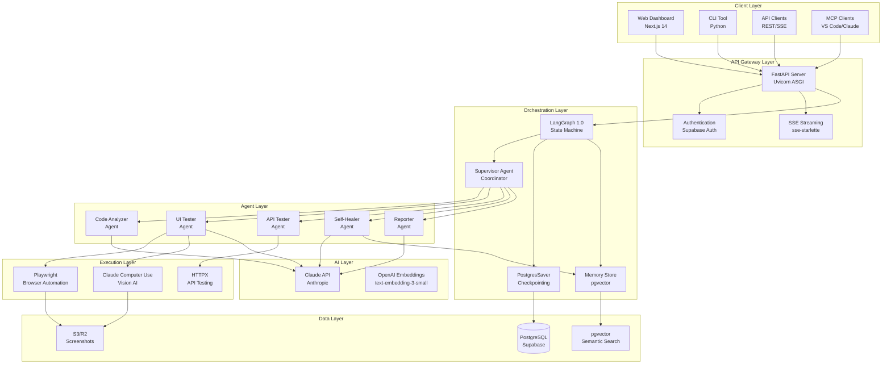

### 2.2 Component Summary Table

| Component | Technology | Version | Purpose |
|-----------|------------|---------|---------|
| Web Dashboard | Next.js | 14.x | User interface |
| API Server | FastAPI | 0.115+ | REST API, SSE streaming |
| Orchestrator | LangGraph | 1.0.5+ | State machine, workflow |
| Checkpointer | PostgresSaver | 2.0+ | Durable execution |
| Memory Store | pgvector | 0.5+ | Semantic search |
| Browser Automation | Playwright | 1.48+ | DOM interaction |
| Vision Testing | Claude Computer Use | - | Screenshot analysis |
| Database | PostgreSQL (Supabase) | 15+ | Persistence |
| Object Storage | S3/R2 | - | Screenshots, artifacts |

---

## 3. LangGraph Orchestration Architecture

### 3.1 State Machine Diagram

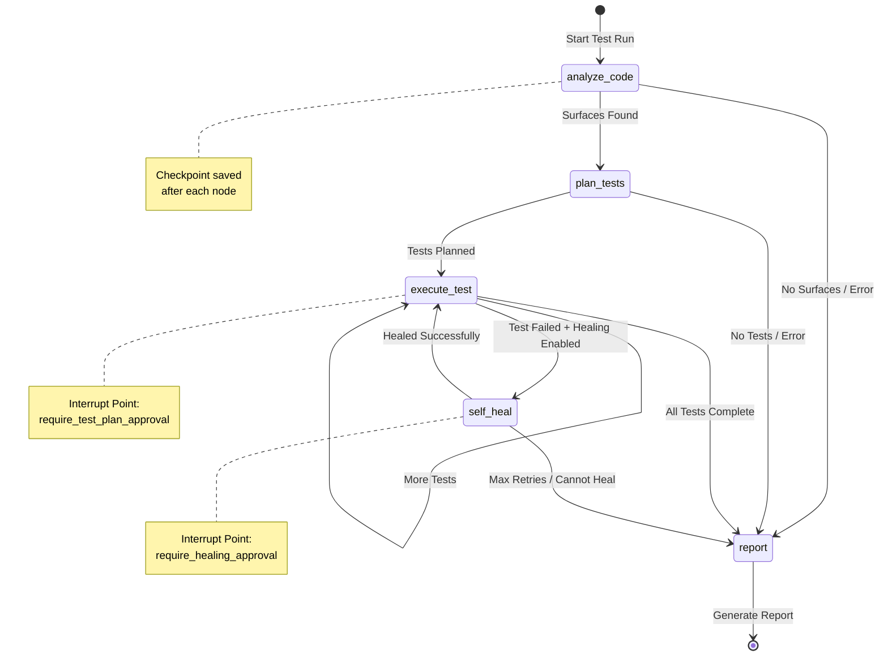

### 3.2 LangGraph Configuration Architecture

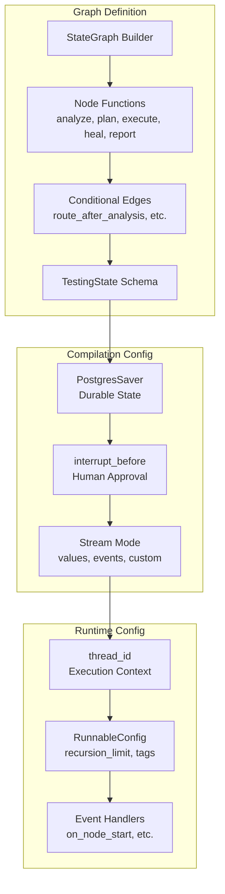

### 3.3 State Schema Definition

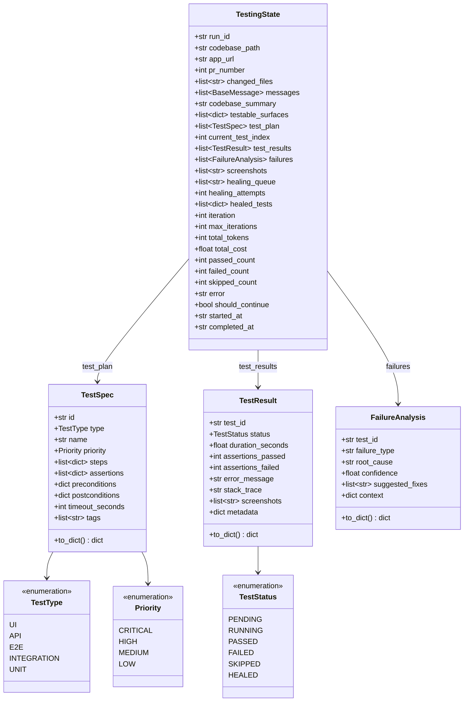

### 3.4 Checkpoint Persistence Flow

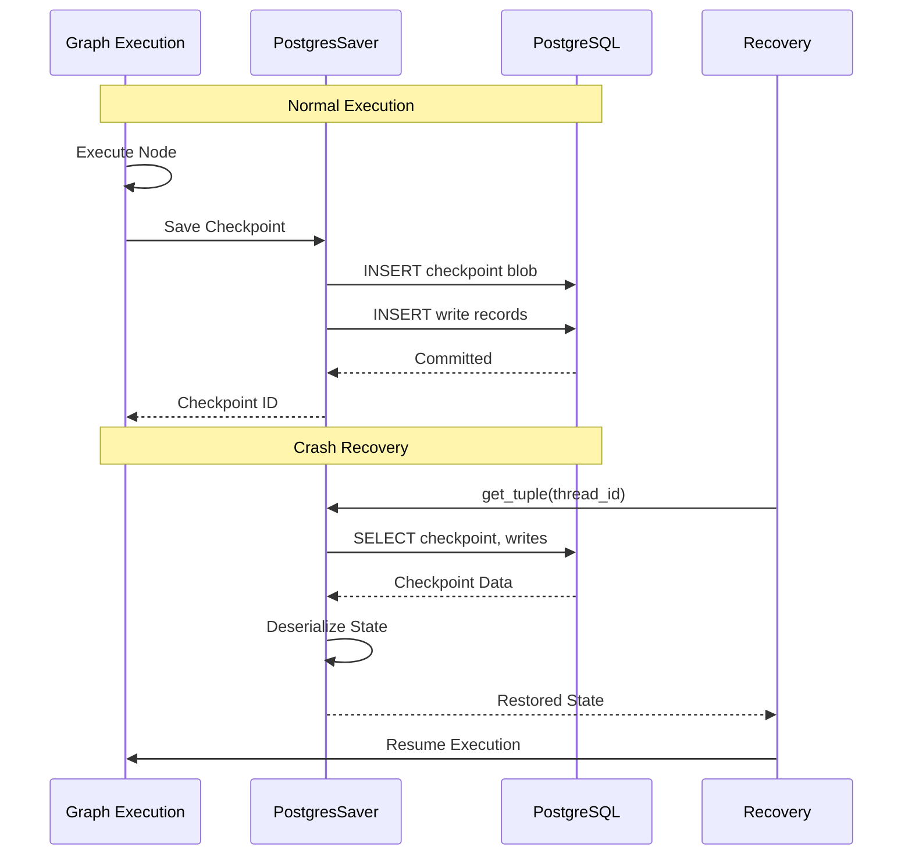

---

## 4. Multi-Agent Architecture

### 4.1 Supervisor Pattern Diagram

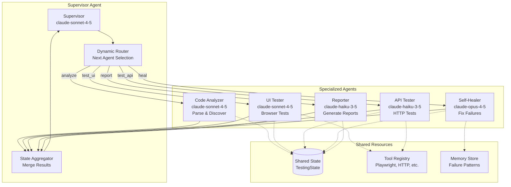

### 4.2 Agent Capabilities Matrix

| Agent | Model | Tools | Outputs |
|-------|-------|-------|---------|
| **Code Analyzer** | Sonnet 4.5 | read_file, glob, grep, parse_ast | testable_surfaces, codebase_summary |
| **UI Tester** | Sonnet 4.5 | playwright_*, computer_use | test_results, screenshots |
| **API Tester** | Haiku 3.5 | http_get, http_post, validate_schema | api_results, response_times |
| **Self-Healer** | Opus 4.5 | analyze_failure, query_memory, generate_fix | healed_tests, confidence |
| **Reporter** | Haiku 3.5 | generate_report, send_notification | report_url, notifications |

### 4.3 Agent Communication Sequence

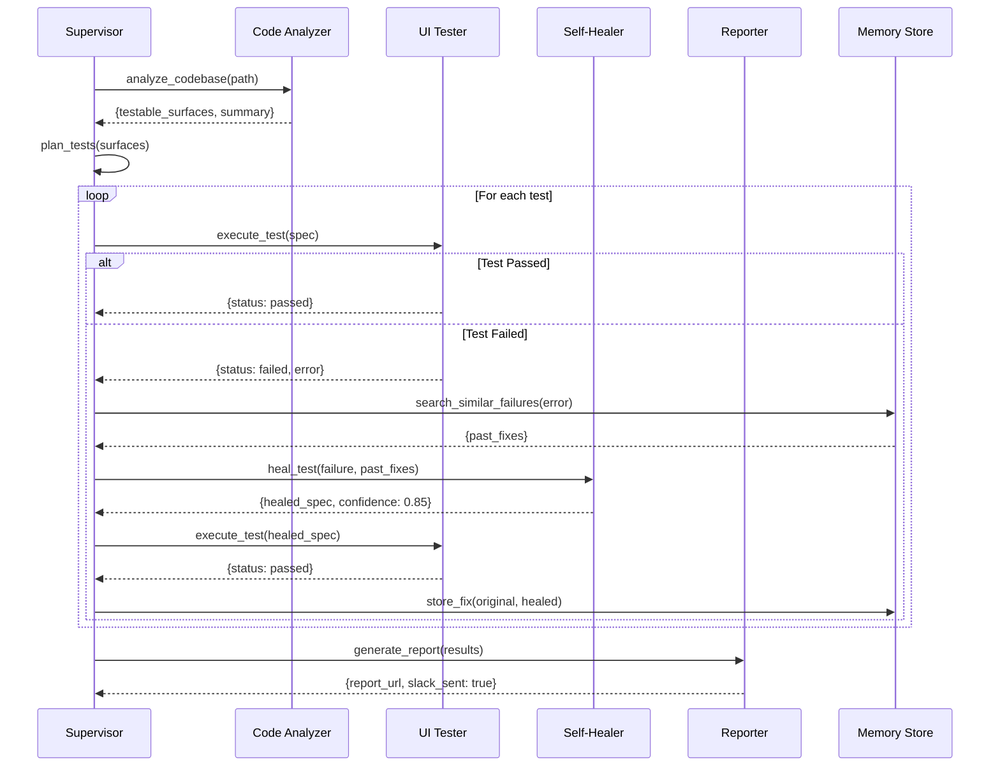

---

## 5. Database Architecture

### 5.1 Entity Relationship Diagram

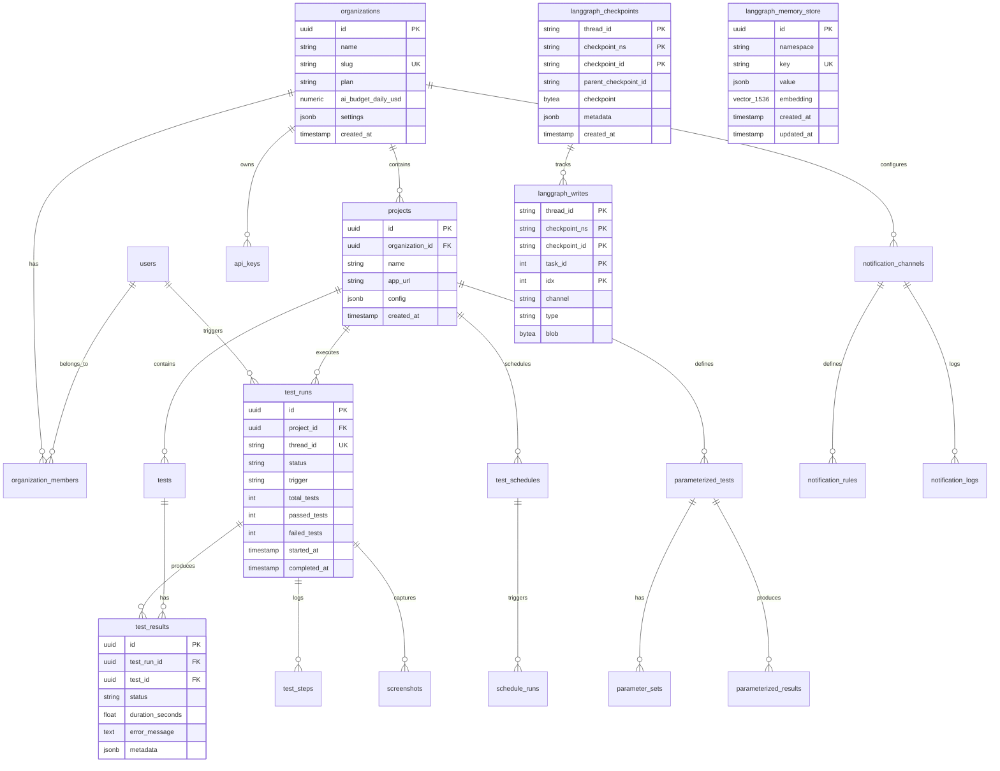

### 5.2 LangGraph Tables Schema

```mermaid
graph TB
    subgraph "Checkpoint Tables"
        CP[langgraph_checkpoints<br/>Primary checkpoint storage]
        WR[langgraph_writes<br/>Incremental writes]
    end

    subgraph "Memory Tables"
        MS[langgraph_memory_store<br/>Long-term memory with vectors]
    end

    subgraph "Checkpoint Fields"
        CP_F[thread_id: TEXT<br/>checkpoint_ns: TEXT<br/>checkpoint_id: TEXT<br/>parent_checkpoint_id: TEXT<br/>checkpoint: BYTEA<br/>metadata: JSONB<br/>created_at: TIMESTAMPTZ]
    end

    subgraph "Write Fields"
        WR_F[thread_id: TEXT<br/>checkpoint_ns: TEXT<br/>checkpoint_id: TEXT<br/>task_id: INT<br/>idx: INT<br/>channel: TEXT<br/>type: TEXT<br/>blob: BYTEA]
    end

    subgraph "Memory Fields"
        MS_F[id: UUID<br/>namespace: TEXT<br/>key: TEXT<br/>value: JSONB<br/>embedding: VECTOR(1536)<br/>created_at: TIMESTAMPTZ<br/>updated_at: TIMESTAMPTZ]
    end

    CP --> CP_F
    WR --> WR_F
    MS --> MS_F

    CP -.->|FK| WR
```

### 5.3 Semantic Search Functions

```sql
-- Search similar failure patterns
CREATE FUNCTION search_similar_failures(
    query_embedding vector(1536),
    match_count int DEFAULT 5,
    similarity_threshold float DEFAULT 0.7
) RETURNS TABLE (
    id uuid,
    namespace text,
    key text,
    value jsonb,
    similarity float
) AS $$
    SELECT
        id, namespace, key, value,
        1 - (embedding <=> query_embedding) as similarity
    FROM langgraph_memory_store
    WHERE namespace = 'failures'
      AND 1 - (embedding <=> query_embedding) > similarity_threshold
    ORDER BY embedding <=> query_embedding
    LIMIT match_count;
$$ LANGUAGE sql;
```

---

## 6. API Architecture

### 6.1 API Endpoint Map

```mermaid
graph TB
    subgraph "Test Execution API"
        E1[POST /api/v1/test/run<br/>Start test execution]
        E2[GET /api/v1/test/status/{id}<br/>Get execution status]
        E3[POST /api/v1/test/cancel/{id}<br/>Cancel execution]
    end

    subgraph "Streaming API"
        S1[POST /api/v1/stream/test<br/>Stream test execution SSE]
        S2[POST /api/v1/stream/chat<br/>Stream chat response SSE]
        S3[GET /api/v1/stream/status/{id}<br/>Get stream status]
        S4[POST /api/v1/stream/resume/{id}<br/>Resume paused stream]
        S5[DELETE /api/v1/stream/cancel/{id}<br/>Cancel stream]
    end

    subgraph "Time Travel API"
        T1[GET /api/v1/time-travel/history/{id}<br/>Get checkpoint history]
        T2[GET /api/v1/time-travel/state/{id}/{cp}<br/>Get state at checkpoint]
        T3[POST /api/v1/time-travel/replay<br/>Replay from checkpoint]
        T4[POST /api/v1/time-travel/fork<br/>Fork execution]
        T5[GET /api/v1/time-travel/compare<br/>Compare two states]
    end

    subgraph "Approval API"
        A1[GET /api/v1/approvals/pending<br/>List pending approvals]
        A2[POST /api/v1/approvals/{id}/approve<br/>Approve and resume]
        A3[POST /api/v1/approvals/{id}/reject<br/>Reject and skip]
        A4[POST /api/v1/approvals/{id}/modify<br/>Modify and resume]
    end

    subgraph "Project API"
        P1[GET /api/v1/projects<br/>List projects]
        P2[POST /api/v1/projects<br/>Create project]
        P3[GET /api/v1/projects/{id}<br/>Get project]
        P4[PATCH /api/v1/projects/{id}<br/>Update project]
    end

    subgraph "Chat API"
        C1[POST /api/v1/chat<br/>Send chat message]
        C2[GET /api/v1/chat/history/{id}<br/>Get chat history]
    end
```

### 6.2 Request/Response Flow

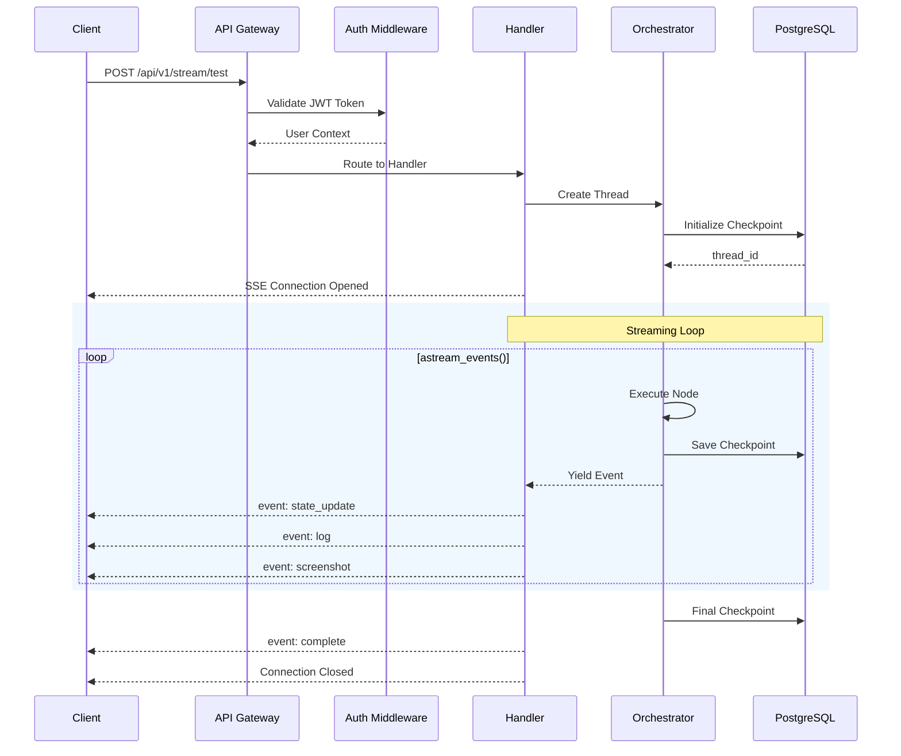

### 6.3 SSE Event Types

| Event Type | Description | Payload |
|------------|-------------|---------|
| `state_update` | Full state snapshot | `{state: TestingState}` |
| `node_start` | Agent activated | `{node: string, timestamp: string}` |
| `node_end` | Agent completed | `{node: string, duration_ms: number}` |
| `log` | Log entry | `{level: string, message: string}` |
| `screenshot` | Screenshot captured | `{base64: string, step: number}` |
| `interrupt` | Awaiting approval | `{node: string, reason: string}` |
| `complete` | Execution finished | `{summary: object}` |
| `error` | Fatal error | `{error: string, stack?: string}` |

---

## 7. Data Flow Architecture

### 7.1 Test Execution Data Flow

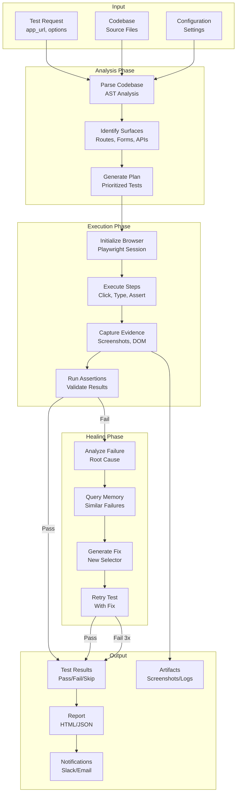

### 7.2 Checkpoint Data Flow

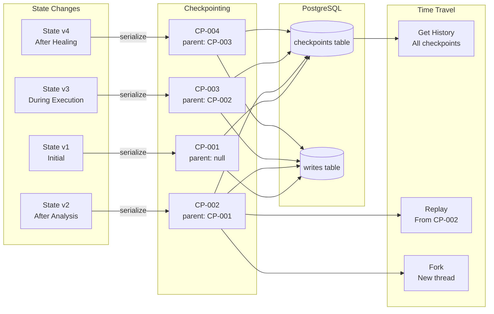

---

## 8. Real-Time Streaming Architecture

### 8.1 SSE Streaming Flow

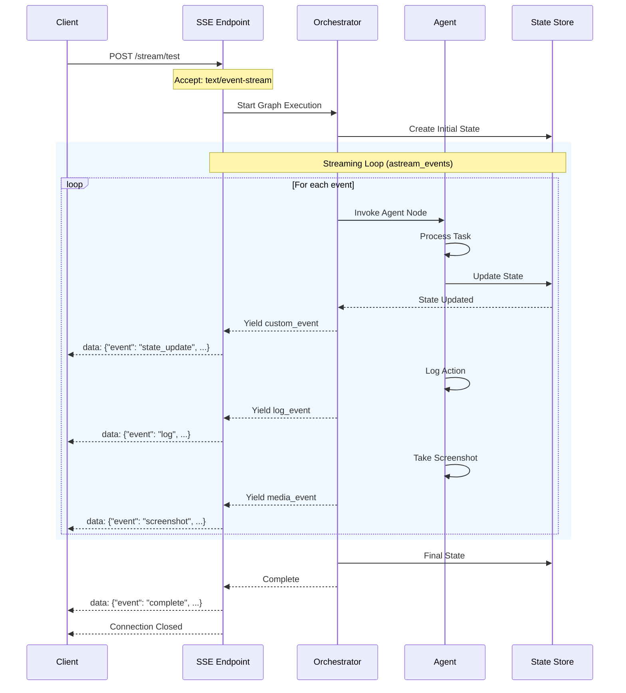

### 8.2 Stream Event Categories

```mermaid
graph TB
    subgraph "Event Types"
        STATE[State Events]
        LOG[Log Events]
        MEDIA[Media Events]
        CONTROL[Control Events]
    end

    subgraph "State Events"
        STATE_UPDATE[state_update<br/>Full state snapshot]
        NODE_START[node_start<br/>Agent activation]
        NODE_END[node_end<br/>Agent completion]
        TOOL_CALL[tool_call<br/>Tool invocation]
    end

    subgraph "Log Events"
        LOG_DEBUG[log:debug]
        LOG_INFO[log:info]
        LOG_WARN[log:warn]
        LOG_ERROR[log:error]
    end

    subgraph "Media Events"
        SCREENSHOT[screenshot<br/>Base64 PNG]
        VIDEO[video_frame<br/>Recording]
        DOM[dom_snapshot<br/>HTML capture]
    end

    subgraph "Control Events"
        INTERRUPT[interrupt<br/>Awaiting approval]
        RESUME[resume<br/>Continuing]
        COMPLETE[complete<br/>Finished]
        ERROR[error<br/>Fatal error]
    end

    STATE --> STATE_UPDATE
    STATE --> NODE_START
    STATE --> NODE_END
    STATE --> TOOL_CALL

    LOG --> LOG_DEBUG
    LOG --> LOG_INFO
    LOG --> LOG_WARN
    LOG --> LOG_ERROR

    MEDIA --> SCREENSHOT
    MEDIA --> VIDEO
    MEDIA --> DOM

    CONTROL --> INTERRUPT
    CONTROL --> RESUME
    CONTROL --> COMPLETE
    CONTROL --> ERROR
```

---

## 9. Human-in-the-Loop Architecture

### 9.1 Approval Workflow State Machine

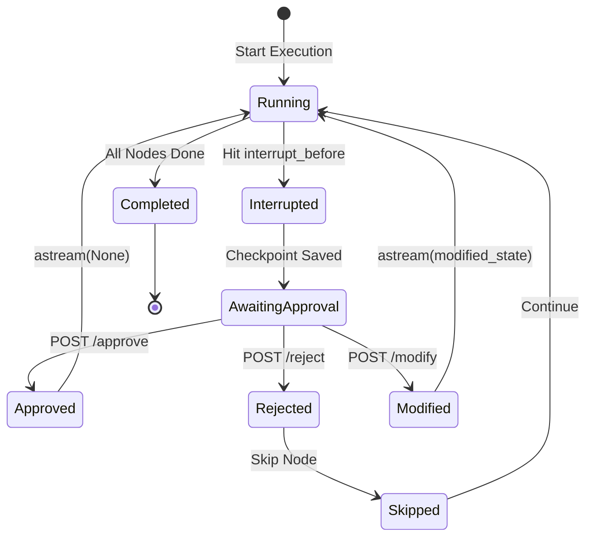

### 9.2 Interrupt Points Configuration

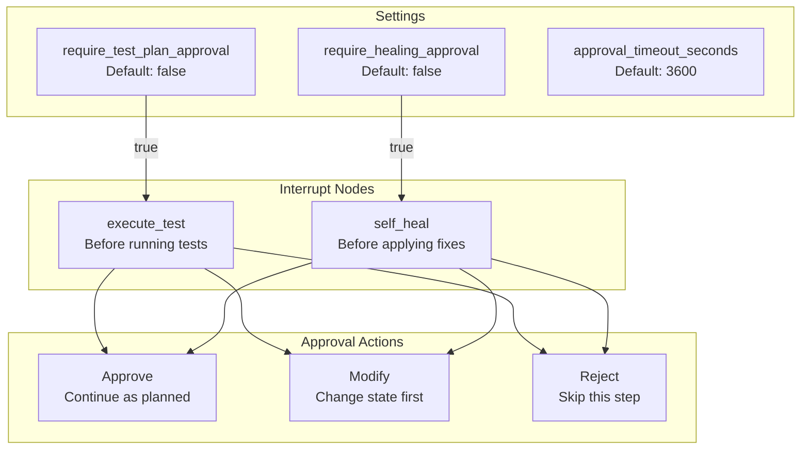

### 9.3 Approval API Sequence

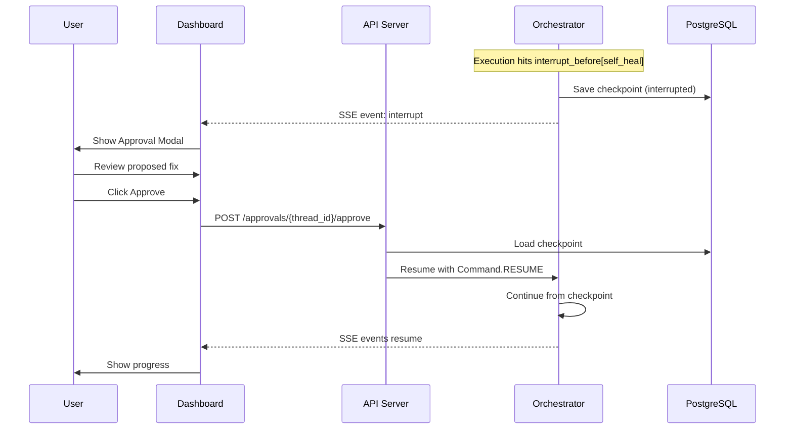

---

## 10. Time Travel & Debugging Architecture

### 10.1 Time Travel Operations

```mermaid
graph TB
    subgraph "Operations"
        HISTORY[GET /history/{thread_id}<br/>List all checkpoints]
        STATE[GET /state/{thread_id}/{checkpoint_id}<br/>View state at point]
        REPLAY[POST /replay<br/>Re-execute from checkpoint]
        FORK[POST /fork<br/>Create new thread branch]
        COMPARE[GET /compare<br/>Diff two states]
    end

    subgraph "Checkpoint Chain"
        CP1[CP-001<br/>analyze_code]
        CP2[CP-002<br/>plan_tests]
        CP3[CP-003<br/>execute_test 1]
        CP4[CP-004<br/>execute_test 2]
        CP5[CP-005<br/>self_heal]
        CP6[CP-006<br/>report]
    end

    subgraph "Fork Example"
        FORK_POINT[Fork from CP-003]
        NEW_THREAD[New thread-456]
        ALT_CP4[Alt CP-004]
        ALT_CP5[Alt CP-005]
    end

    CP1 --> CP2 --> CP3 --> CP4 --> CP5 --> CP6

    HISTORY -.-> CP1
    HISTORY -.-> CP2
    HISTORY -.-> CP3

    STATE -.-> CP3

    REPLAY --> CP3

    CP3 --> FORK_POINT
    FORK_POINT --> NEW_THREAD
    NEW_THREAD --> ALT_CP4
    ALT_CP4 --> ALT_CP5

    COMPARE -.-> CP4
    COMPARE -.-> ALT_CP4
```

### 10.2 State Comparison Logic

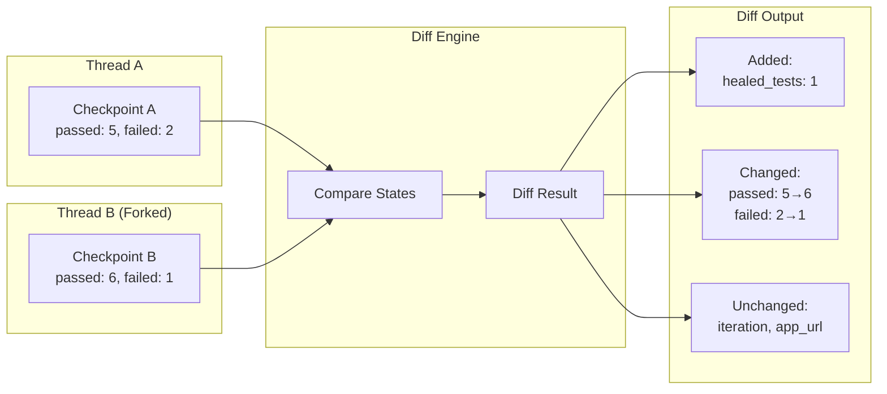

---

## 11. Memory Store Architecture

### 11.1 Long-Term Memory with pgvector

```mermaid
graph TB
    subgraph "Memory Operations"
        STORE[store()<br/>Save to memory]
        GET[get()<br/>Retrieve by key]
        SEARCH[search_similar()<br/>Vector similarity]
        UPDATE[update()<br/>Modify existing]
    end

    subgraph "Memory Namespaces"
        FAILURES[failures<br/>Error patterns]
        FIXES[fixes<br/>Successful repairs]
        SELECTORS[selectors<br/>Element history]
        CONTEXT[context<br/>Test context]
    end

    subgraph "Embedding Pipeline"
        TEXT[Content Text]
        EMBED[OpenAI Embeddings<br/>text-embedding-3-small]
        VECTOR[Vector 1536d]
    end

    subgraph "Storage"
        PG[(PostgreSQL)]
        PGVEC[pgvector<br/>HNSW Index]
    end

    STORE --> TEXT
    TEXT --> EMBED
    EMBED --> VECTOR
    VECTOR --> PGVEC
    PGVEC --> PG

    SEARCH --> EMBED
    EMBED --> PGVEC

    FAILURES --> STORE
    FIXES --> STORE
    SELECTORS --> STORE
    CONTEXT --> STORE
```

### 11.2 Semantic Search for Self-Healing

```mermaid
sequenceDiagram
    participant SH as Self-Healer Agent
    participant MS as Memory Store
    participant EMB as OpenAI Embeddings
    participant DB as PostgreSQL

    Note over SH: Test failed: "Element #submit-btn not found"

    SH->>MS: search_similar("Element #submit-btn not found", namespace="failures")
    MS->>EMB: Create embedding for query
    EMB-->>MS: Vector [1536 dimensions]

    MS->>DB: SELECT * FROM langgraph_memory_store<br/>WHERE namespace = 'failures'<br/>ORDER BY embedding <=> query_vector<br/>LIMIT 5

    DB-->>MS: 3 similar failures found

    MS-->>SH: [<br/>  {pattern: "button renamed", fix: "use data-testid"},<br/>  {pattern: "dynamic ID", fix: "use aria-label"},<br/>  {pattern: "lazy load", fix: "wait for visible"}<br/>]

    Note over SH: Apply most confident fix

    SH->>SH: Generate new selector using pattern

    Note over SH: Test passes with new selector

    SH->>MS: store("fix", {original: "#submit-btn", healed: "[data-testid='submit']"})
    MS->>EMB: Create embedding
    EMB-->>MS: Vector
    MS->>DB: INSERT INTO langgraph_memory_store
    DB-->>MS: Stored

    SH-->>SH: Return healed test
```

---

## 12. Security Architecture

### 12.1 Security Layers Diagram

```mermaid
graph TB
    subgraph "Perimeter"
        WAF[Cloudflare WAF]
        DDOS[DDoS Protection]
        TLS[TLS 1.3]
    end

    subgraph "Authentication"
        SUPABASE_AUTH[Supabase Auth]
        JWT[JWT Tokens]
        API_KEYS[API Keys]
    end

    subgraph "Authorization"
        RBAC[Role-Based Access<br/>admin, member, viewer]
        RLS[Row-Level Security<br/>Supabase Policies]
        SCOPES[API Key Scopes<br/>read, write, admin]
    end

    subgraph "Data Security"
        ENCRYPT[Encryption at Rest<br/>AES-256]
        REDACT[Secret Redaction<br/>Automatic]
        AUDIT[Audit Logging<br/>All Actions]
    end

    subgraph "Runtime Security"
        SANDBOX[Docker Sandbox<br/>Isolated Execution]
        TIMEOUT[Execution Timeout<br/>Max 10 minutes]
        COST[Cost Limits<br/>Per-org budgets]
    end

    WAF --> SUPABASE_AUTH
    DDOS --> SUPABASE_AUTH
    TLS --> SUPABASE_AUTH

    SUPABASE_AUTH --> JWT
    SUPABASE_AUTH --> API_KEYS

    JWT --> RBAC
    API_KEYS --> SCOPES
    RBAC --> RLS

    RLS --> ENCRYPT
    ENCRYPT --> REDACT
    REDACT --> AUDIT

    AUDIT --> SANDBOX
    SANDBOX --> TIMEOUT
    TIMEOUT --> COST
```

### 12.2 Authentication Flow

```mermaid
sequenceDiagram
    participant U as User
    participant D as Dashboard
    participant AUTH as Supabase Auth
    participant API as API Server
    participant DB as Database

    U->>D: Login (email/password)
    D->>AUTH: signInWithPassword()
    AUTH->>AUTH: Validate credentials
    AUTH-->>D: {access_token, refresh_token}
    D->>D: Store tokens

    U->>D: Start Test Run
    D->>API: POST /stream/test<br/>Authorization: Bearer {token}
    API->>AUTH: Verify JWT
    AUTH-->>API: {user_id, org_id, role}
    API->>DB: Query with RLS
    Note over DB: WHERE org_id = auth.org_id()
    DB-->>API: Filtered data
    API-->>D: SSE Stream
```

### 12.3 Row-Level Security Policies

```sql
-- Organizations: users see only their orgs
CREATE POLICY "org_member_access" ON organizations
    FOR ALL USING (
        id IN (
            SELECT organization_id
            FROM organization_members
            WHERE user_id = auth.uid()
        )
    );

-- Test runs: scoped to org's projects
CREATE POLICY "test_run_org_access" ON test_runs
    FOR ALL USING (
        project_id IN (
            SELECT p.id FROM projects p
            JOIN organization_members om
                ON om.organization_id = p.organization_id
            WHERE om.user_id = auth.uid()
        )
    );

-- Checkpoints: only accessible via thread_id with RLS
CREATE POLICY "checkpoint_access" ON langgraph_checkpoints
    FOR ALL USING (
        thread_id IN (
            SELECT tr.thread_id FROM test_runs tr
            JOIN projects p ON p.id = tr.project_id
            JOIN organization_members om
                ON om.organization_id = p.organization_id
            WHERE om.user_id = auth.uid()
        )
    );
```

---

## 13. Deployment Architecture

### 13.1 Production Deployment Diagram

```mermaid
graph TB
    subgraph "Edge Layer"
        CF[Cloudflare CDN<br/>Global Edge]
    end

    subgraph "Load Balancing"
        LB[Application Load Balancer<br/>Health Checks]
    end

    subgraph "Application Tier"
        API1[API Server 1<br/>FastAPI]
        API2[API Server 2<br/>FastAPI]
        API3[API Server N<br/>FastAPI]
    end

    subgraph "Worker Tier"
        W1[Worker 1<br/>Browser + Execution]
        W2[Worker 2<br/>Browser + Execution]
        W3[Worker N<br/>Browser + Execution]
    end

    subgraph "Data Tier"
        PG[(PostgreSQL<br/>Supabase)]
        PGVEC[pgvector<br/>Extension]
        S3[S3/R2<br/>Artifacts]
    end

    subgraph "External APIs"
        ANTHROPIC[Anthropic API<br/>Claude]
        OPENAI[OpenAI API<br/>Embeddings]
    end

    CF --> LB
    LB --> API1
    LB --> API2
    LB --> API3

    API1 --> PG
    API2 --> PG
    API3 --> PG

    W1 --> PG
    W2 --> PG
    W3 --> PG

    W1 --> S3
    W2 --> S3
    W3 --> S3

    PG --> PGVEC

    API1 --> ANTHROPIC
    W1 --> ANTHROPIC
    W1 --> OPENAI
```

### 13.2 Container Architecture

```mermaid
graph TB
    subgraph "Docker Compose / Kubernetes"
        subgraph "API Service"
            API[api<br/>FastAPI + Uvicorn]
            API_ENV[Environment:<br/>DATABASE_URL<br/>ANTHROPIC_API_KEY]
        end

        subgraph "Worker Service"
            WORKER[worker<br/>Test Executor]
            BROWSER[playwright<br/>Chromium]
        end

        subgraph "Dashboard Service"
            DASH[dashboard<br/>Next.js]
        end

        subgraph "Database"
            PG[postgres:15<br/>+ pgvector]
        end
    end

    API --> PG
    WORKER --> PG
    WORKER --> BROWSER
    DASH --> API

    API --> API_ENV
```

### 13.3 Scaling Configuration

| Component | Scaling Strategy | Trigger |
|-----------|-----------------|---------|
| API Servers | Horizontal | CPU > 70%, Latency > 500ms |
| Workers | Horizontal | Queue depth > 10 |
| Database | Read replicas | Read queries > 1000/s |
| Memory Store | Partition by namespace | Table size > 10GB |

---

## 14. Integration Architecture

### 14.1 External Integrations Map

```mermaid
graph TB
    subgraph "CI/CD"
        GH_ACTIONS[GitHub Actions]
        GITLAB_CI[GitLab CI]
        JENKINS[Jenkins]
    end

    subgraph "Communication"
        SLACK[Slack]
        TEAMS[MS Teams]
        EMAIL[Email]
    end

    subgraph "Issue Tracking"
        JIRA[Jira]
        LINEAR[Linear]
        GH_ISSUES[GitHub Issues]
    end

    subgraph "Observability"
        SENTRY[Sentry]
        DATADOG[Datadog]
    end

    subgraph "Argus Core"
        WEBHOOK[Webhook Handler]
        NOTIFIER[Notification Service]
        TICKET[Ticket Creator]
    end

    GH_ACTIONS -->|Webhook| WEBHOOK
    GITLAB_CI -->|Webhook| WEBHOOK
    JENKINS -->|Webhook| WEBHOOK

    SENTRY -->|Webhook| WEBHOOK
    DATADOG -->|Webhook| WEBHOOK

    NOTIFIER --> SLACK
    NOTIFIER --> TEAMS
    NOTIFIER --> EMAIL

    TICKET --> JIRA
    TICKET --> LINEAR
    TICKET --> GH_ISSUES
```

### 14.2 MCP Server Integration

```mermaid
graph TB
    subgraph "MCP Clients"
        VSCODE[VS Code<br/>Extension]
        CLAUDE_DESKTOP[Claude Desktop]
        CURSOR[Cursor IDE]
    end

    subgraph "Argus MCP Server"
        MCP[argus-mcp-server<br/>Cloudflare Worker]
        TOOLS[Tools]
        RESOURCES[Resources]
    end

    subgraph "Available MCP Tools"
        T1[run_test<br/>Execute tests]
        T2[get_results<br/>Fetch results]
        T3[analyze_code<br/>Discover surfaces]
        T4[heal_test<br/>Fix failures]
        T5[get_history<br/>Time travel]
    end

    VSCODE --> MCP
    CLAUDE_DESKTOP --> MCP
    CURSOR --> MCP

    MCP --> TOOLS
    MCP --> RESOURCES

    TOOLS --> T1
    TOOLS --> T2
    TOOLS --> T3
    TOOLS --> T4
    TOOLS --> T5
```

---

## 15. Technology Stack

### 15.1 Complete Stack Table

| Layer | Technology | Version | Purpose |
|-------|------------|---------|---------|
| **Frontend** | Next.js | 14.x | Dashboard UI |
| **Frontend** | React | 18.x | Component library |
| **Frontend** | Tailwind CSS | 3.x | Styling |
| **Backend** | Python | 3.11+ | Core runtime |
| **Backend** | FastAPI | 0.115+ | REST API |
| **Backend** | Uvicorn | 0.32+ | ASGI server |
| **Orchestration** | LangGraph | 1.0.5+ | State machine |
| **Orchestration** | langgraph-checkpoint-postgres | 2.0+ | Checkpointing |
| **AI** | Anthropic SDK | 0.75+ | Claude API |
| **AI** | OpenAI SDK | 1.0+ | Embeddings |
| **Browser** | Playwright | 1.48+ | Automation |
| **Database** | PostgreSQL | 15+ | Primary DB |
| **Database** | pgvector | 0.5+ | Vector search |
| **Database** | Supabase | - | Managed Postgres |
| **Streaming** | sse-starlette | 2.0+ | SSE support |
| **Validation** | Pydantic | 2.9+ | Data validation |

### 15.2 Python Dependencies

```toml
[dependencies]
# Core AI
anthropic = ">=0.75.0,<1.0.0"
langgraph = ">=1.0.5,<2.0.0"
langchain-anthropic = ">=1.3.0,<2.0.0"
langchain-core = ">=1.2.5,<2.0.0"

# LangGraph Checkpointing
langgraph-checkpoint = ">=2.0.0"
langgraph-checkpoint-postgres = ">=2.0.0"
psycopg = {extras = ["binary"], version = ">=3.1.0"}

# Web Automation
playwright = ">=1.48.0"
httpx = ">=0.27.0"

# API Server
fastapi = ">=0.115.0"
uvicorn = ">=0.32.0"
sse-starlette = ">=2.0.0"

# Database
supabase = ">=2.0.0"
asyncpg = ">=0.29.0"

# Embeddings
openai = ">=1.0.0"

# Validation
pydantic = ">=2.9.0"
pydantic-settings = ">=2.5.0"
```

---

## 16. Cost Management

### 16.1 AI Model Routing Strategy

```mermaid
graph TB
    subgraph "Task Classification"
        TASK[Incoming Task]
        CLASSIFY[Classify Complexity]
    end

    subgraph "Model Selection"
        TRIVIAL[Trivial<br/>→ Haiku 3.5]
        SIMPLE[Simple<br/>→ Haiku 3.5]
        MODERATE[Moderate<br/>→ Sonnet 4.5]
        COMPLEX[Complex<br/>→ Sonnet 4.5]
        EXPERT[Expert<br/>→ Opus 4.5]
    end

    subgraph "Cost per 1K tokens"
        C1[$0.001]
        C2[$0.001]
        C3[$0.003]
        C4[$0.003]
        C5[$0.015]
    end

    TASK --> CLASSIFY
    CLASSIFY --> TRIVIAL --> C1
    CLASSIFY --> SIMPLE --> C2
    CLASSIFY --> MODERATE --> C3
    CLASSIFY --> COMPLEX --> C4
    CLASSIFY --> EXPERT --> C5
```

### 16.2 Cost Tracking Schema

| Table | Purpose |
|-------|---------|
| `ai_usage` | Per-request token and cost tracking |
| `ai_usage_daily` | Daily aggregation by org |
| `organizations.ai_budget_daily_usd` | Daily spending limit |
| `organizations.ai_spend_today_usd` | Current day spend |

### 16.3 Estimated Monthly Costs

| Component | Provider | Cost Range |
|-----------|----------|------------|
| API Server | Railway/Render | $50-150 |
| Database | Supabase Pro | $25-50 |
| AI (Claude) | Anthropic | $500-2000 |
| AI (Embeddings) | OpenAI | $20-50 |
| **Total** | | **$595-2250** |

---

## 17. Version History

### 17.1 Version Timeline

```mermaid
gantt
    title Argus Version History
    dateFormat YYYY-MM-DD

    section v1.0.0
    Initial Release           :done, v1, 2025-12-01, 2025-12-15

    section v1.1.0
    Self-Healing Agent        :done, v11, 2025-12-15, 2025-12-20

    section v1.2.0
    Dashboard UI              :done, v12, 2025-12-20, 2025-12-28

    section v1.3.0
    Scheduling & Notifications:done, v13, 2025-12-28, 2026-01-05

    section v2.0.0
    LangGraph 1.0 Features    :done, v20, 2026-01-05, 2026-01-09
```

### 17.2 Changelog

| Version | Date | Git Commit | Changes |
|---------|------|------------|---------|
| **2.0.0** | 2026-01-09 | `e22fef1` | LangGraph 1.0 feature suite: PostgresSaver, Memory Store, SSE Streaming, Human-in-the-loop, Multi-agent Supervisor, Time Travel API, Chat Graph |
| 1.3.0 | 2026-01-05 | `bd93905` | Test scheduling, notification channels, parameterized tests |
| 1.2.0 | 2025-12-28 | - | Dashboard with real-time updates, test visualization |
| 1.1.0 | 2025-12-20 | `f8f2bf5` | Self-healing agent, retry logic, error categorization |
| 1.0.0 | 2025-12-15 | - | Initial release: Code analyzer, UI tester, API tester, Reporter |

---

## 18. Architecture Decision Records

### ADR Summary Table

| ADR | Decision | Date | Status | Rationale |
|-----|----------|------|--------|-----------|
| ADR-001 | Use LangGraph for orchestration | 2025-11-15 | Accepted | Built-in checkpointing, streaming, interrupts |
| ADR-002 | PostgreSQL for checkpointing | 2025-11-20 | Accepted | Durable, queryable, time travel support |
| ADR-003 | Hybrid Playwright + Computer Use | 2025-11-25 | Accepted | Speed of Playwright + intelligence of vision AI |
| ADR-004 | Supabase for auth and database | 2025-12-01 | Accepted | RLS, realtime, managed Postgres |
| ADR-005 | pgvector for semantic search | 2026-01-05 | Accepted | Native Postgres, no external vector DB |
| ADR-006 | SSE over WebSocket for streaming | 2026-01-07 | Accepted | Simpler, HTTP-based, better proxy support |
| ADR-007 | Multi-agent Supervisor pattern | 2026-01-08 | Accepted | Centralized coordination, easier debugging |
| ADR-008 | OpenAI for embeddings | 2026-01-09 | Accepted | Better quality than alternatives, reasonable cost |

### ADR-006: SSE over WebSocket

**Context:** Need real-time streaming for test execution feedback.

**Decision:** Use Server-Sent Events (SSE) instead of WebSocket.

**Rationale:**
- SSE works over standard HTTP (better proxy/firewall support)
- Simpler implementation (no connection upgrade)
- Automatic reconnection built-in
- Sufficient for server-to-client streaming (our use case)
- sse-starlette provides excellent FastAPI integration

**Consequences:**
- Client-to-server messages require separate HTTP requests
- Unidirectional only (acceptable for our use case)

---

## Appendix A: Environment Variables Reference

```bash
# Core AI
ANTHROPIC_API_KEY=sk-ant-...
OPENAI_API_KEY=sk-...

# Database
DATABASE_URL=postgresql://...
SUPABASE_URL=https://xxx.supabase.co
SUPABASE_ANON_KEY=eyJ...
SUPABASE_SERVICE_KEY=eyJ...

# LangGraph
LANGGRAPH_CHECKPOINT_DB=postgresql://...

# Execution Settings
DEFAULT_MODEL=claude-sonnet-4-5
MAX_ITERATIONS=50
COST_LIMIT_PER_RUN=10.00
SELF_HEAL_ENABLED=true
SELF_HEAL_MAX_RETRIES=3

# Streaming
SSE_KEEPALIVE_INTERVAL=15
STREAM_TIMEOUT=3600

# Human-in-the-Loop
REQUIRE_HEALING_APPROVAL=false
REQUIRE_TEST_PLAN_APPROVAL=false
APPROVAL_TIMEOUT_SECONDS=3600

# Integrations
SLACK_WEBHOOK_URL=https://hooks.slack.com/...
GITHUB_TOKEN=ghp_...
```

---

## Appendix B: API Quick Reference

### Streaming Endpoints

| Method | Endpoint | Description |
|--------|----------|-------------|
| POST | `/api/v1/stream/test` | Stream test execution (SSE) |
| POST | `/api/v1/stream/chat` | Stream chat response (SSE) |
| GET | `/api/v1/stream/status/{thread_id}` | Get stream status |
| POST | `/api/v1/stream/resume/{thread_id}` | Resume paused stream |

### Time Travel Endpoints

| Method | Endpoint | Description |
|--------|----------|-------------|
| GET | `/api/v1/time-travel/history/{thread_id}` | Get checkpoint history |
| GET | `/api/v1/time-travel/state/{thread_id}/{checkpoint_id}` | Get state at checkpoint |
| POST | `/api/v1/time-travel/replay` | Replay from checkpoint |
| POST | `/api/v1/time-travel/fork` | Fork execution |

### Approval Endpoints

| Method | Endpoint | Description |
|--------|----------|-------------|
| GET | `/api/v1/approvals/pending` | List pending approvals |
| POST | `/api/v1/approvals/{thread_id}/approve` | Approve and resume |
| POST | `/api/v1/approvals/{thread_id}/reject` | Reject and skip |

---

## Appendix C: Recent Changes (January 2026)

### v2.8.0 Security & Infrastructure Updates

**Security Improvements:**
- Fixed hardcoded JWT secret fallback vulnerability
- Replaced permissive RLS policies (`USING(true)`) with proper organization-scoped policies
- Added authentication to all recording endpoints
- Fixed development mode auth bypass
- Added SSRF protection to URL validation
- Fixed CORS wildcard in Cloudflare Worker
- Added authentication to `/storage/*` endpoint
- Enabled HTTPS for browser pool URL
- Fixed race conditions in pattern_service.py and healing.py
- Added missing foreign key constraints
- Fixed frontend-backend type mismatches
- Changed default passwords in Kubernetes configs
- Added comprehensive security headers (CSP, HSTS, X-Frame-Options)

**Performance Improvements:**
- Fixed N+1 queries in project listing (batch query via `get_project_test_counts()` RPC)
- Fixed N+1 queries in organization listing (batch query via `get_org_member_counts()` RPC)
- Fixed N+1 in bulk test operations
- Added recording upload size limits (50MB max)
- Added request size middleware (100MB max)
- Implemented transaction boundaries for invitation acceptance and org creation

**Model Router Updates:**
- Added OpenRouter as primary provider (single API for 300+ models)
- Integrated DeepSeek V3.2 (90% cost reduction vs Claude for similar quality)
- Integrated DeepSeek R1 (10% cost of o1 for reasoning tasks)
- Fixed model key consistency (`llama-small` instead of `llama-3.1-8b`)
- Added `ModelProvider.OPENROUTER` handling in `_get_router_client()`

**Infrastructure Updates:**
- Browser Pool: Updated resource specifications (750m CPU, 1.5Gi memory per pod)
- KEDA: Added production scalers for Chrome/Firefox/Edge
- Session Cleanup: Added CronJob for stuck session cleanup
- AI-Controlled Sessions: Added `estimate_session_config()` for intelligent timeouts

### Architecture Audit Summary (January 17, 2026)

**Core Architecture:**
- 7 LangGraph state fields with intelligent reducers
- PostgresSaver for durable execution with automatic checkpointing
- pgvector-powered memory store for semantic failure search
- Supervisor pattern with 23 specialized agents

**API Layer:**
- 40 route modules with 80+ endpoints
- 7-layer middleware stack (CORS → Headers → Audit → Rate Limit → Auth → Request Size → Core)
- Multi-method authentication (API Key, JWT, Clerk, Service Account)
- Fine-grained RBAC with scope-based permission validation

**Data Layer:**
- 40+ tables organized into functional domains
- RLS policies with organization membership checks
- pgvector HNSW indexes for O(log n) semantic search
- Comprehensive foreign key relationships with CASCADE/SET NULL behaviors

**AI/ML Integration:**
- Multi-model routing with 45+ models across 9 providers
- Task-based model selection (TRIVIAL → EXPERT tiers)
- Budget enforcement per organization (daily/monthly limits)
- 60-80% cost savings via intelligent routing

---

*Document generated: 2026-01-17T05:30:00Z*
*Architecture Version: 2.8.0*
*Git Commit: 918c51a*
*Argus E2E Testing Agent*
