# Argus E2E Testing Platform - Complete Architecture Diagrams

> **Comprehensive technical diagrams showing every feature, functionality, component, and data flow in the Argus platform.**

This document contains the following diagram types:
- **C4 Model Diagrams** (Context, Container, Component levels)
- **Sequence Diagrams** (UI → API → DB flows)
- **Entity-Relationship Diagrams** (Database schema)
- **Module Dependency Graphs**
- **Data Flow Diagrams**
- **Agent Capability Matrix**
- **Authentication & Authorization Flows**

---

## Table of Contents

1. [C4 Level 1 - System Context Diagram](#1-c4-model---system-context-level-1)
2. [C4 Level 2 - Container Diagram](#2-c4-model---container-diagram-level-2)
3. [C4 Level 3 - Component Diagram (Backend)](#3-c4-model---component-diagram-level-3---backend)
4. [Sequence Diagram - Test Execution Flow](#4-sequence-diagram---ui--api--db-flow-test-execution)
5. [Entity-Relationship Diagram (ERD)](#5-entity-relationship-diagram-erd---database-schema)
6. [Module Dependency Graph](#6-module-dependency-graph)
7. [Data Flow Diagram - Complete User Journey](#7-data-flow-diagram---complete-user-journey)
8. [API Endpoints → Database Table Mapping](#8-api-endpoints--database-table-mapping)
9. [Agent Capability Matrix](#9-agent-capability-matrix)
10. [Frontend Component Hierarchy](#10-frontend-component-hierarchy)
11. [Authentication & Authorization Flow](#11-authentication--authorization-flow)
12. [Self-Healing Intelligence Flow](#12-self-healing-intelligence-flow)
13. [Diagram Types Reference](#diagram-types--terminology)

---

## 1. C4 MODEL - SYSTEM CONTEXT (Level 1)

> Shows the Argus platform in context with external systems and users.

```mermaid
graph TB
    subgraph External["External Systems"]
        User["👤 QA Engineer/Developer"]
        GitHub["GitHub<br/>Code Repository"]
        Slack["Slack<br/>Notifications"]
        CICD["CI/CD Pipeline<br/>GitHub Actions"]
        Claude["Claude AI<br/>Anthropic API"]
        Cloudflare["Cloudflare<br/>Browser Rendering"]
        Crawlee["Crawlee Service<br/>Web Crawling"]
    end

    subgraph Argus["ARGUS PLATFORM"]
        Dashboard["Next.js Dashboard<br/>Web UI"]
        Backend["FastAPI Backend<br/>Python"]
        Supabase["Supabase<br/>PostgreSQL + Auth"]
    end

    User --> Dashboard
    Dashboard --> Backend
    Backend --> Supabase
    Backend --> Claude
    Backend --> Cloudflare
    Backend --> Crawlee
    Backend --> GitHub
    Backend --> Slack
    CICD --> Backend

    style Argus fill:#e1f5fe,stroke:#01579b
    style External fill:#f3e5f5,stroke:#7b1fa2
```

---

## 2. C4 MODEL - CONTAINER DIAGRAM (Level 2)

> Shows the major containers (applications/services) that make up the Argus platform.

```mermaid
graph TB
    subgraph Frontend["📱 FRONTEND LAYER"]
        Dashboard["Next.js Dashboard<br/>React + TypeScript<br/>:3000"]
        Extension["Browser Extension<br/>Chrome/Firefox"]
    end

    subgraph Backend["⚙️ BACKEND LAYER"]
        API["FastAPI Server<br/>Python 3.14<br/>:8000"]
        Worker["Cloudflare Worker<br/>Browser Automation"]
        CrawleeService["Crawlee Service<br/>Node.js<br/>:3002"]
        MCPServer["MCP Server<br/>Tool Interface"]
    end

    subgraph Orchestration["🔄 ORCHESTRATION LAYER"]
        LangGraph["LangGraph<br/>State Machine"]
        Supervisor["Supervisor Agent<br/>Task Router"]
        Agents["AI Agents Pool<br/>Specialized Workers"]
    end

    subgraph Storage["💾 DATA LAYER"]
        Supabase["Supabase PostgreSQL<br/>+ pgvector"]
        R2["Cloudflare R2<br/>Screenshots/Artifacts"]
        Redis["Redis Cache<br/>Session State"]
    end

    subgraph External["🌐 EXTERNAL SERVICES"]
        Claude["Claude API<br/>Anthropic"]
        Clerk["Clerk Auth<br/>Authentication"]
        Resend["Resend<br/>Email Service"]
        Stripe["Stripe<br/>Billing"]
    end

    Dashboard --> API
    Extension --> API
    Dashboard --> Clerk

    API --> LangGraph
    LangGraph --> Supervisor
    Supervisor --> Agents
    API --> CrawleeService
    API --> Worker

    Agents --> Claude
    API --> Supabase
    API --> R2
    API --> Redis

    API --> Resend
    API --> Stripe

    style Frontend fill:#c8e6c9,stroke:#2e7d32
    style Backend fill:#bbdefb,stroke:#1565c0
    style Orchestration fill:#fff3e0,stroke:#ef6c00
    style Storage fill:#f3e5f5,stroke:#7b1fa2
    style External fill:#fce4ec,stroke:#c2185b
```

---

## 3. C4 MODEL - COMPONENT DIAGRAM (Level 3) - BACKEND

> Shows the internal components of the FastAPI backend.

```mermaid
graph TB
    subgraph API["📡 API Layer (src/api/)"]
        Server["server.py<br/>FastAPI App"]
        Auth["security/<br/>auth.py, rbac.py"]
        Projects["projects.py"]
        Tests["tests.py"]
        Discovery["discovery.py"]
        Visual["visual_ai.py"]
        Healing["healing.py"]
        Chat["chat.py"]
        Streaming["streaming.py"]
        Webhooks["webhooks.py"]
        TimeTrav["time_travel.py"]
        Approvals["approvals.py"]
    end

    subgraph Agents["🤖 AI Agents (src/agents/)"]
        BaseAgent["base.py<br/>BaseAgent"]
        CodeAnalyzer["code_analyzer.py"]
        TestPlanner["test_planner.py"]
        UITester["ui_tester.py"]
        APITester["api_tester.py"]
        DBTester["db_tester.py"]
        SelfHealer["self_healer.py"]
        Reporter["reporter.py"]
        VisualAI["visual_ai.py"]
        SecurityScanner["security_scanner.py"]
        AccessibilityChecker["accessibility_checker.py"]
        FlakyDetector["flaky_detector.py"]
        NLPTestCreator["nlp_test_creator.py"]
        AutoDiscovery["auto_discovery.py"]
    end

    subgraph Orchestrator["🎯 Orchestration (src/orchestrator/)"]
        Graph["graph.py<br/>LangGraph State Machine"]
        GraphV2["graph_v2.py"]
        SupervisorMod["supervisor.py<br/>Multi-Agent Router"]
        State["state.py<br/>TestingState"]
        Nodes["nodes.py"]
        ChatGraph["chat_graph.py"]
        Checkpointer["checkpointer.py<br/>PostgresSaver"]
        MemoryStore["memory_store.py<br/>pgvector"]
    end

    subgraph Services["🔧 Services (src/services/)"]
        SupabaseClient["supabase_client.py"]
        EmailService["email_service.py"]
        CrawleeClient["crawlee_client.py"]
        GitAnalyzer["git_analyzer.py"]
        AITracker["ai_cost_tracker.py"]
        Cache["cache.py"]
        Vectorize["vectorize.py"]
    end

    subgraph ComputerUse["🖥️ Computer Use (src/computer_use/)"]
        Client["client.py"]
        Actions["actions.py"]
        Sandbox["sandbox.py"]
        Screenshot["screenshot.py"]
    end

    subgraph VisualAICore["👁️ Visual AI (src/visual_ai/)"]
        SemanticAnalyzer["semantic_analyzer.py"]
        StructuralAnalyzer["structural_analyzer.py"]
        PerceptualAnalyzer["perceptual_analyzer.py"]
        CrossBrowser["cross_browser_analyzer.py"]
        Responsive["responsive_analyzer.py"]
        Accessibility["accessibility_analyzer.py"]
    end

    Server --> Auth
    Server --> Projects
    Server --> Tests
    Server --> Discovery
    Server --> Visual
    Server --> Healing
    Server --> Chat
    Server --> Streaming
    Server --> Webhooks

    Projects --> Graph
    Tests --> Graph
    Discovery --> Graph

    Graph --> SupervisorMod
    Graph --> State
    Graph --> Nodes
    SupervisorMod --> Agents

    Agents --> BaseAgent
    BaseAgent --> CodeAnalyzer
    BaseAgent --> TestPlanner
    BaseAgent --> UITester
    BaseAgent --> APITester
    BaseAgent --> SelfHealer

    UITester --> ComputerUse
    VisualAI --> VisualAICore

    Graph --> Checkpointer
    Graph --> MemoryStore

    Checkpointer --> SupabaseClient
    MemoryStore --> SupabaseClient

    style API fill:#e3f2fd
    style Agents fill:#fff8e1
    style Orchestrator fill:#e8f5e9
    style Services fill:#fce4ec
    style ComputerUse fill:#f3e5f5
    style VisualAICore fill:#e0f7fa
```

---

## 4. SEQUENCE DIAGRAM - UI → API → DB FLOW (Test Execution)

> Shows the complete flow of a test execution from user click to results display.

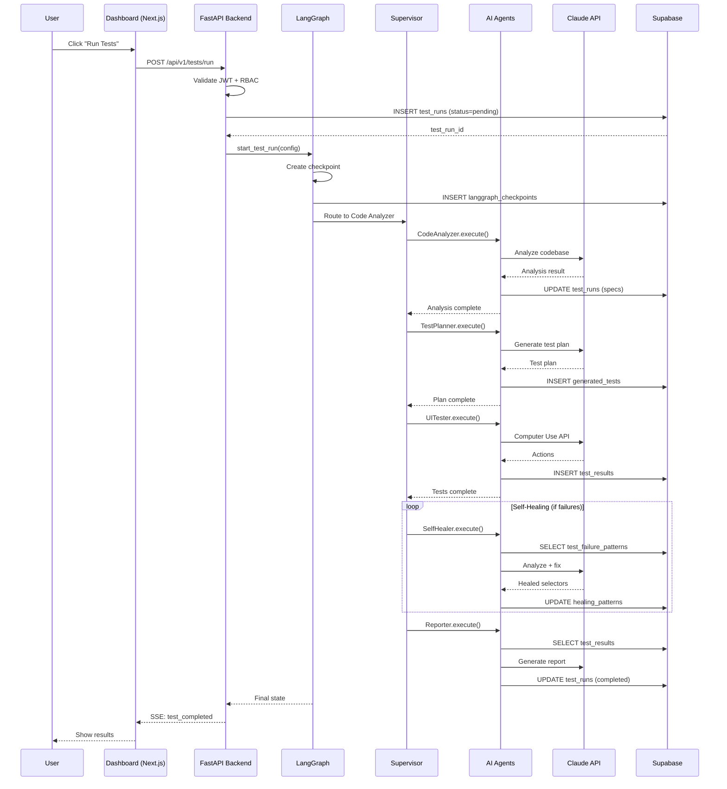

---

## 5. ENTITY-RELATIONSHIP DIAGRAM (ERD) - DATABASE SCHEMA

> Shows all database tables and their relationships.

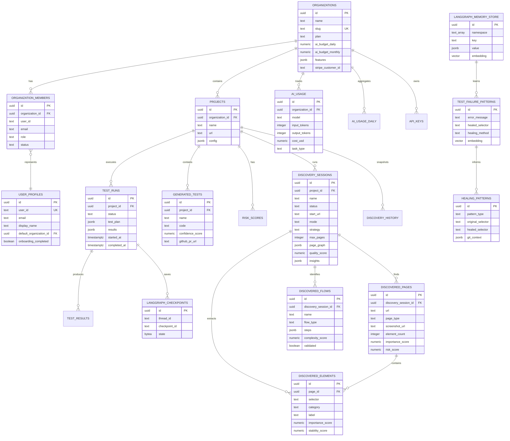

---

## 6. MODULE DEPENDENCY GRAPH

> Shows how Python modules depend on each other.

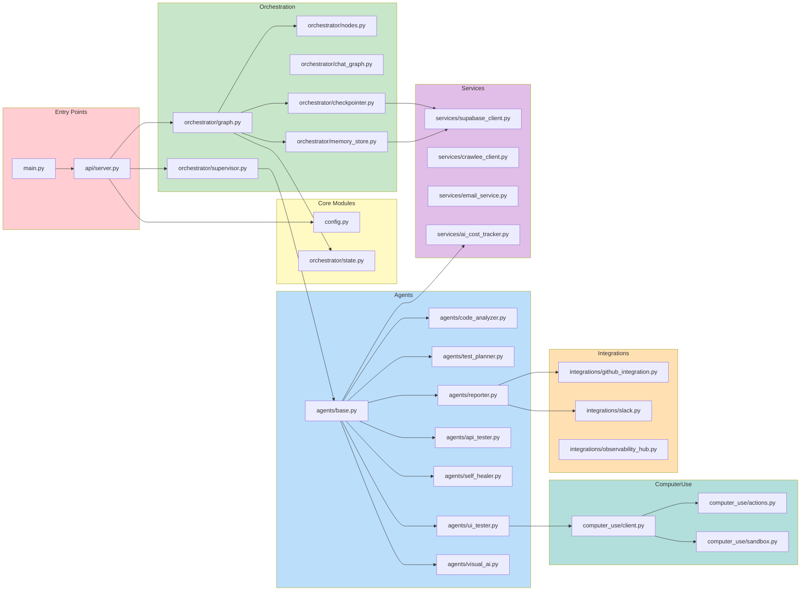

---

## 7. DATA FLOW DIAGRAM - COMPLETE USER JOURNEY

> Shows how data flows through the entire system from user action to database.

```mermaid
flowchart TB
    subgraph User["👤 USER ACTIONS"]
        Login["Login via Clerk"]
        SelectProject["Select Project"]
        StartDiscovery["Start Discovery"]
        RunTests["Run Tests"]
        ViewResults["View Results"]
    end

    subgraph Dashboard["📱 NEXT.JS DASHBOARD"]
        AuthProvider["Clerk Auth Provider"]
        OrgContext["Organization Context"]
        ProjectsPage["Projects Page"]
        DiscoveryPage["Discovery Page"]
        TestsPage["Tests Page"]
        ResultsPage["Results Page"]
        RealtimeSSE["SSE Streaming"]
    end

    subgraph API["⚙️ FASTAPI BACKEND"]
        AuthMiddleware["JWT Validation"]
        RBACCheck["RBAC Authorization"]
        ProjectsAPI["GET /projects"]
        DiscoveryAPI["POST /discovery/start"]
        TestsAPI["POST /tests/run"]
        StreamAPI["GET /stream/{session_id}"]
    end

    subgraph Orchestration["🎯 LANGGRAPH"]
        TestGraph["Testing Graph"]
        DiscoveryGraph["Discovery Graph"]
        StateManager["State Manager"]
        Checkpoint["PostgresSaver"]
    end

    subgraph Agents["🤖 AI AGENTS"]
        direction TB
        CodeAnalyzer["Code Analyzer"]
        TestPlanner["Test Planner"]
        UITester["UI Tester"]
        SelfHealer["Self Healer"]
        Reporter["Reporter"]
        AutoDiscovery["Auto Discovery"]
    end

    subgraph External["🌐 EXTERNAL"]
        Claude["Claude API"]
        Cloudflare["Cloudflare Browser"]
        CrawleeExt["Crawlee Service"]
    end

    subgraph Database["💾 SUPABASE"]
        direction TB
        OrgTable["organizations"]
        ProjectTable["projects"]
        TestRunTable["test_runs"]
        DiscoveryTable["discovery_sessions"]
        PagesTable["discovered_pages"]
        CheckpointTable["langgraph_checkpoints"]
        MemoryTable["langgraph_memory_store"]
    end

    Login --> AuthProvider
    AuthProvider --> OrgContext
    OrgContext --> ProjectsPage

    SelectProject --> ProjectsPage
    ProjectsPage --> ProjectsAPI
    ProjectsAPI --> AuthMiddleware
    AuthMiddleware --> RBACCheck
    RBACCheck --> ProjectTable

    StartDiscovery --> DiscoveryPage
    DiscoveryPage --> DiscoveryAPI
    DiscoveryAPI --> DiscoveryGraph
    DiscoveryGraph --> AutoDiscovery
    AutoDiscovery --> CrawleeExt
    AutoDiscovery --> Claude
    AutoDiscovery --> DiscoveryTable
    AutoDiscovery --> PagesTable

    RunTests --> TestsPage
    TestsPage --> TestsAPI
    TestsAPI --> TestGraph
    TestGraph --> StateManager
    StateManager --> Checkpoint
    Checkpoint --> CheckpointTable

    TestGraph --> CodeAnalyzer
    CodeAnalyzer --> Claude
    CodeAnalyzer --> TestPlanner
    TestPlanner --> Claude
    TestPlanner --> UITester
    UITester --> Claude
    UITester --> Cloudflare
    UITester --> SelfHealer
    SelfHealer --> MemoryTable
    SelfHealer --> Reporter
    Reporter --> TestRunTable

    StreamAPI --> RealtimeSSE
    RealtimeSSE --> ResultsPage
    ViewResults --> ResultsPage

    style User fill:#e8f5e9
    style Dashboard fill:#e3f2fd
    style API fill:#fff3e0
    style Orchestration fill:#f3e5f5
    style Agents fill:#fffde7
    style External fill:#fce4ec
    style Database fill:#e0f2f1
```

---

## 8. API ENDPOINTS → DATABASE TABLE MAPPING

> Shows which API endpoints interact with which database tables.

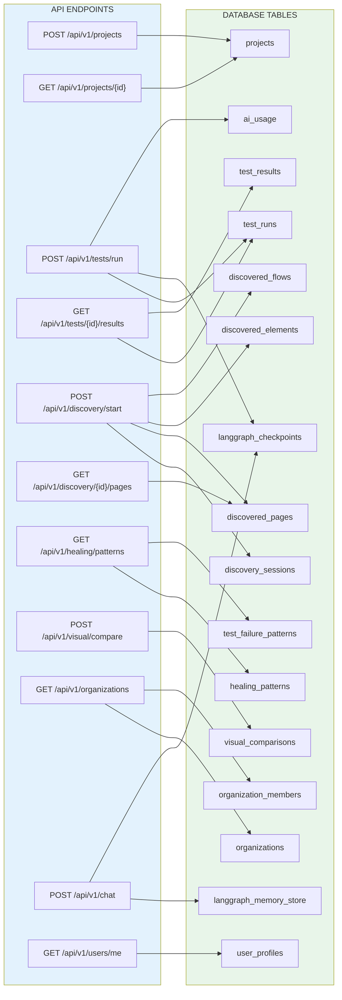

---

## 9. AGENT CAPABILITY MATRIX

> Shows which agents have which capabilities and use which tools.

```mermaid
graph TB
    subgraph Agents["🤖 AI AGENTS"]
        CA["CodeAnalyzer"]
        TP["TestPlanner"]
        UT["UITester"]
        AT["APITester"]
        DT["DBTester"]
        SH["SelfHealer"]
        RP["Reporter"]
        VA["VisualAI"]
        AD["AutoDiscovery"]
        SS["SecurityScanner"]
        AC["AccessibilityChecker"]
        FD["FlakyDetector"]
        NT["NLPTestCreator"]
        PA["PerformanceAnalyzer"]
        RA["RootCauseAnalyzer"]
    end

    subgraph Capabilities["CAPABILITIES"]
        C1["Parse Codebase"]
        C2["Generate Tests"]
        C3["Execute UI Tests"]
        C4["Execute API Tests"]
        C5["Validate Database"]
        C6["Fix Broken Tests"]
        C7["Generate Reports"]
        C8["Visual Comparison"]
        C9["Discover App Structure"]
        C10["Security Scanning"]
        C11["Accessibility Check"]
        C12["Detect Flaky Tests"]
        C13["NLP to Tests"]
        C14["Performance Analysis"]
        C15["Root Cause Analysis"]
    end

    subgraph Tools["TOOLS USED"]
        T1["Claude API"]
        T2["Computer Use"]
        T3["Playwright"]
        T4["httpx"]
        T5["SQLAlchemy"]
        T6["pgvector"]
        T7["Tree-sitter"]
        T8["Crawlee"]
        T9["Cloudflare Browser"]
    end

    CA --> C1
    CA --> T7

    TP --> C2
    TP --> T1

    UT --> C3
    UT --> T2
    UT --> T3
    UT --> T9

    AT --> C4
    AT --> T4

    DT --> C5
    DT --> T5

    SH --> C6
    SH --> T6
    SH --> T1

    RP --> C7
    RP --> T1

    VA --> C8
    VA --> T1
    VA --> T9

    AD --> C9
    AD --> T8
    AD --> T9

    SS --> C10
    SS --> T1

    AC --> C11
    AC --> T1

    FD --> C12
    FD --> T6

    NT --> C13
    NT --> T1

    PA --> C14
    PA --> T1

    RA --> C15
    RA --> T1
    RA --> T6

    style Agents fill:#fff8e1
    style Capabilities fill:#e8f5e9
    style Tools fill:#e3f2fd
```

---

## 10. FRONTEND COMPONENT HIERARCHY

> Shows the Next.js application structure and component organization.

```mermaid
graph TB
    subgraph App["📱 NEXT.JS APP (dashboard/app/)"]
        Layout["layout.tsx<br/>Root Layout + Providers"]

        subgraph Pages["Pages"]
            Home["page.tsx<br/>Landing"]
            Dashboard["dashboard/page.tsx"]
            Projects["projects/page.tsx"]
            ProjectDetail["projects/[id]/page.tsx"]
            Tests["tests/page.tsx"]
            Discovery["discovery/page.tsx"]
            Visual["visual/page.tsx"]
            VisualDetail["visual/[comparisonId]/page.tsx"]
            Healing["healing/page.tsx"]
            Quality["quality/page.tsx"]
            Insights["insights/page.tsx"]
            Schedules["schedules/page.tsx"]
            Settings["settings/page.tsx"]
            Team["team/page.tsx"]
            Organizations["organizations/page.tsx"]
            Audit["audit/page.tsx"]
            Chat["chat/page.tsx"]
            Orchestrator["orchestrator/[sessionId]/page.tsx"]
            Profile["profile/page.tsx"]
            Notifications["notifications/page.tsx"]
            Onboarding["onboarding/page.tsx"]
            APIKeys["api-keys/page.tsx"]
        end
    end

    subgraph Components["🧩 COMPONENTS (dashboard/components/)"]
        UI["ui/<br/>shadcn/ui"]
        Layout2["layout/<br/>Sidebar, Header"]
        ProjectsComp["projects/<br/>ProjectCard, List"]
        TestsComp["tests/<br/>TestRunner, Results"]
        DiscoveryComp["discovery/<br/>FlowEditor, PageGraph"]
        VisualComp["visual/<br/>ComparisonViewer, Matrix"]
        ChatComp["chat/<br/>ChatInterface"]
        DashboardComp["dashboard/<br/>Metrics, Charts"]
        Shared["shared/<br/>LoadingStates, Errors"]
    end

    subgraph Lib["📚 LIB (dashboard/lib/)"]
        API["api.ts<br/>Org-scoped Fetch"]
        AuthAPI["auth-api.ts<br/>Authenticated Fetch"]
        Utils["utils.ts"]
        Providers["providers.tsx<br/>Clerk, Themes"]
    end

    subgraph Stores["🗄️ STORES (dashboard/stores/)"]
        OrgStore["Organization Store"]
        ProjectStore["Project Store"]
        NotifStore["Notification Store"]
    end

    Layout --> Pages
    Pages --> Components
    Components --> UI
    Pages --> Lib
    Pages --> Stores

    style App fill:#e8f5e9
    style Components fill:#e3f2fd
    style Lib fill:#fff8e1
    style Stores fill:#fce4ec
```

---

## 11. AUTHENTICATION & AUTHORIZATION FLOW

> Shows the complete auth flow from login to authorized API access.

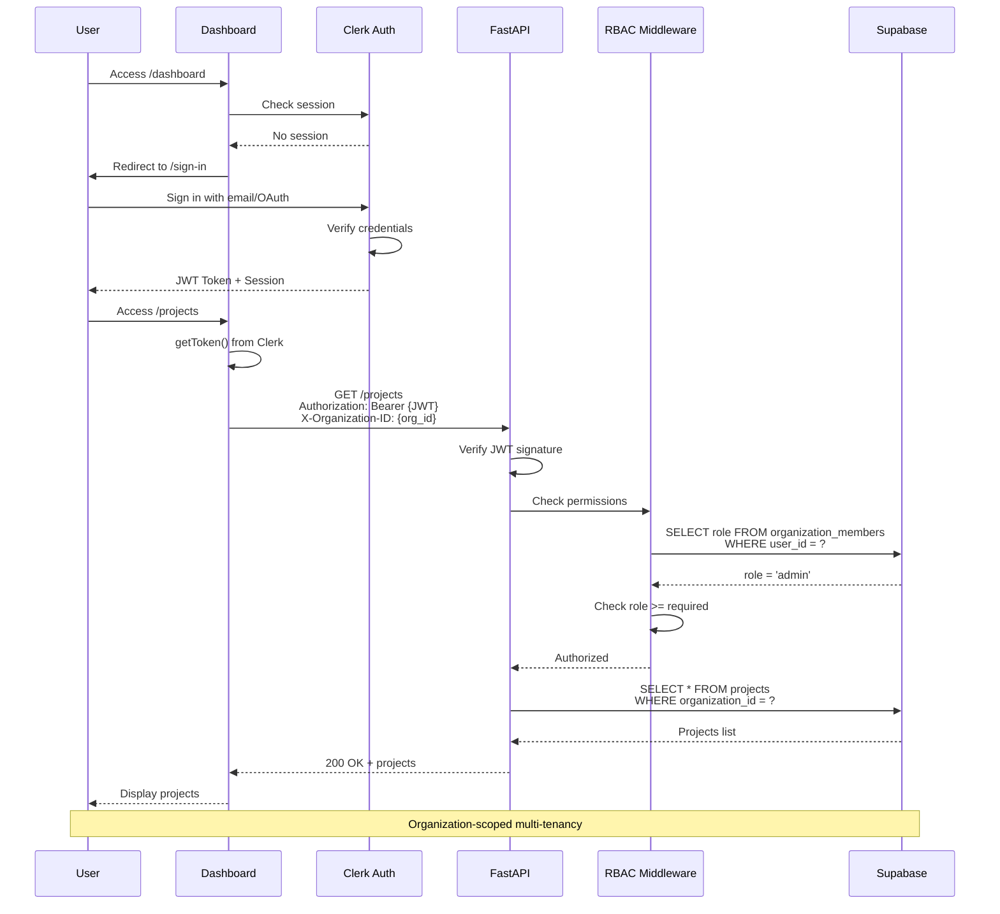

---

## 12. SELF-HEALING INTELLIGENCE FLOW

> Shows how the self-healing system learns from failures and fixes tests automatically.

```mermaid
flowchart TB
    subgraph Failure["❌ Test Failure Detected"]
        F1["UI Test Fails"]
        F2["Selector Not Found"]
        F3["Element Changed"]
    end

    subgraph Analysis["🔍 Failure Analysis"]
        A1["Extract Error Message"]
        A2["Get Screenshot"]
        A3["Capture DOM State"]
        A4["Get Git Context"]
    end

    subgraph Memory["🧠 Memory Search (pgvector)"]
        M1["Generate Error Embedding"]
        M2["search_similar_failures()"]
        M3["Retrieve Past Solutions"]
        M4["Calculate Success Rates"]
    end

    subgraph Healing["💊 Healing Strategy"]
        H1["Apply Best Past Solution"]
        H2["Generate New Selector"]
        H3["Use Claude for Analysis"]
        H4["Try Alternative Strategies"]
    end

    subgraph Validation["✅ Validation"]
        V1["Re-run Failed Test"]
        V2["Verify Fix Works"]
        V3["Update Success Count"]
    end

    subgraph Learning["📚 Learning Update"]
        L1["Store New Pattern"]
        L2["Update Embeddings"]
        L3["Increment Stats"]
        L4["Cross-project Learning"]
    end

    F1 --> A1
    F2 --> A1
    F3 --> A1

    A1 --> A2
    A2 --> A3
    A3 --> A4

    A4 --> M1
    M1 --> M2
    M2 --> M3
    M3 --> M4

    M4 -->|"High Success Rate"| H1
    M4 -->|"Low/No Match"| H2
    H2 --> H3
    H3 --> H4

    H1 --> V1
    H4 --> V1
    V1 --> V2

    V2 -->|"Success"| V3
    V3 --> L1
    L1 --> L2
    L2 --> L3
    L3 --> L4

    V2 -->|"Failure"| H4

    style Failure fill:#ffcdd2
    style Analysis fill:#fff9c4
    style Memory fill:#e1bee7
    style Healing fill:#c8e6c9
    style Validation fill:#bbdefb
    style Learning fill:#b2dfdb
```

---

## Diagram Types & Terminology

| Diagram Type | Purpose | What It Shows | When to Use |
|-------------|---------|---------------|-------------|
| **C4 Model** | Multi-level architecture | System → Container → Component → Code | Stakeholder presentations, documentation |
| **Sequence Diagram** | Runtime behavior | UI → API → DB call flow | Understanding request/response flows |
| **Entity-Relationship Diagram (ERD)** | Data modeling | Tables, columns, relationships | Database design, data governance |
| **Component Diagram** | Static structure | Modules and dependencies | Understanding code organization |
| **Data Flow Diagram (DFD)** | Data movement | How data transforms through system | Security analysis, GDPR compliance |
| **Dependency Graph** | Module coupling | Import/dependency relationships | Refactoring, build optimization |
| **State Machine Diagram** | Process flows | States and transitions | Workflow engines like LangGraph |
| **Deployment Diagram** | Infrastructure | Servers, containers, networks | DevOps, cloud architecture |

---

## Quick Reference: Platform Summary

| Layer | Technologies | Key Files |
|-------|-------------|-----------|
| **Frontend** | Next.js 15, React, TypeScript, Tailwind, shadcn/ui | `dashboard/app/`, `dashboard/components/` |
| **Backend API** | FastAPI, Python 3.14, Pydantic | `src/api/server.py`, `src/api/*.py` |
| **Orchestration** | LangGraph, PostgresSaver, pgvector | `src/orchestrator/*.py` |
| **AI Agents** | Claude Sonnet/Opus/Haiku, 15+ specialized agents | `src/agents/*.py` |
| **Computer Use** | Claude Computer Use API, Playwright hybrid | `src/computer_use/*.py` |
| **Visual AI** | Semantic, Structural, Perceptual analyzers | `src/visual_ai/*.py` |
| **Discovery** | Crawlee, Page Graph, Flow Detection | `src/discovery/*.py` |
| **Database** | Supabase PostgreSQL, pgvector, 25+ tables | `supabase/migrations/*.sql` |
| **Auth** | Clerk, JWT, RBAC | `src/api/security/*.py` |
| **Integrations** | GitHub, Slack, Stripe, Resend | `src/integrations/*.py` |

---

*Generated on: 2026-01-12*
*Last updated: Auto-generated from codebase analysis*
